```{r setup, include = FALSE}
knitr::opts_chunk$set(
  eval = TRUE,
  warning = FALSE,
  message = FALSE
  )
```


# Introduction

## Background

Genetic risk prediction plays an increasingly important role in precision medicine by quantifying how inherited genetic variation contributes to complex traits. Approaches such as polygenic risk scores (PRS) for disease risk stratification, drug response prediction for individualized treatment, and genetically regulated expression (GReX) models for linking genetic variation to transcriptomic architecture illustrate the expanding influence of statistical genetics on biomedical research and its emerging role in clinical translation.

Despite these advances, prediction performance remains limited in clinically underrepresented populations with scarce data. To address these gaps, we previously introduced `BRIER` [LINK TO BRIER1], which integrates a well-powered external model with either individual- or summary-level data from a target cohort using a Bregman divergence framework. Here, we introduce `BRIER2`, a comprehensive update of the previous version. 

## Key Modules

`BRIER2` implements a flexible Bregman-divergence based integration framework to improve prediction of complex traits in a target local cohort by leveraging information from external sources under diverse data-availability settings. The framework is implemented through three principled module functions, `BRIER.FULL`, `BRIER.I`, and `BRIER.S`. Below, we briefly describe the setting for which each function is designed and provide worked examples illustrating their use.

`BRIER.FULL` is designed for settings in which **individual-level data** are available in both the target cohort and the external cohort. In particular, both the outcome \(y\) and predictor matrix \(X\) are observed for samples from each data source.

`BRIER.I` is designed for settings in which **individual-level data** are available in the target cohort, but the external sources do not share raw data and instead provide only **pre-trained models** (e.g., published PRS weights, penalized regression coefficients). Such settings commonly arise in applications such as predicting binary disease status using gene expression profiles [cite1], or constructing genetic prognostic models for time-to-event outcomes [cite2].

`BRIER.S` is designed for settings where only summary statistics (e.g. GWAS summary statistics and LD matrix) are available in both target and external cohorts. This module is particularly useful for constructing predictors such as polygenic risk scores (PRS) [cite3] from GWAS summary statistics, or genetically regulated expression (GReX) models from eQTL summary statistics [cite4].

We provide a flowchart outlining the `BRIER2` pipeline and its major components.

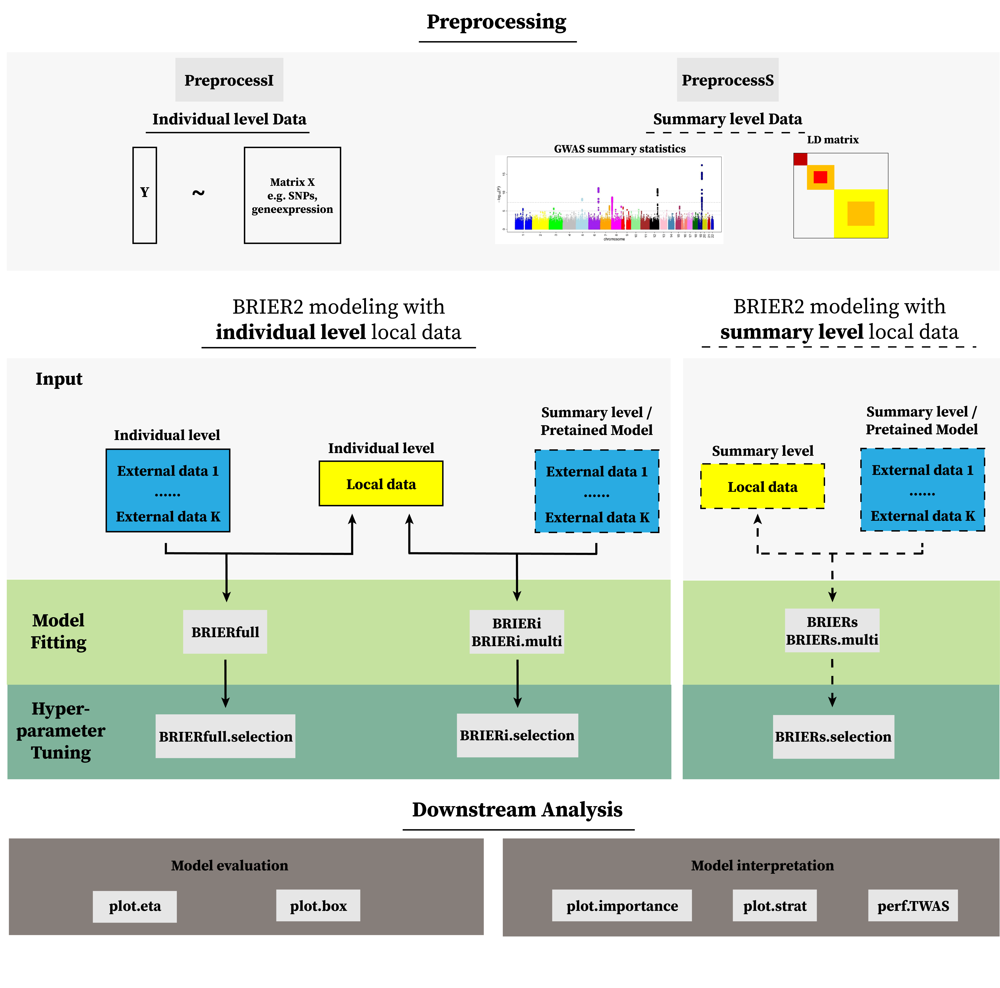{width=100%}

## Features

`BRIER2` provides a comprehensive and flexible framework for integrative genetic risk modeling, with the following key features:

- **Flexibility to integrate external information according to different data access and privacy constraints**
  `BRIER2` flexibly integrates external information with target data across a wide range of data-availability scenarios, including individual-level data, summary statistics, and pre-trained external models.
- **Support various distribution families from complex traits**  
  `BRIER2` supports a wide range of distribution families to accommodate continuous, binomial, count, and time-to-event outcomes.
- **A suite of hyperparameter tuning tools.**  
  Provide information-criterion based hyperparameter tuning for all three main modeling functions (`BRIERfull.selection`, `BRIERi.selection`, and `BRIERs.selection`) without requiring an independent validation set.
- **Integration of multiple external models.**  
  Ensemble-based weighting of multiple external models (`BRIERi.multi`, `BRIERs.multi`) enables scalable integration of multiple information sources without inflating the hyperparameter space, substantially reducing computational burden.

In addition, `BRIER2` includes several features designed to improve practical usability in genetic applications:

- **Improved computational efficiency.**  
  Core components are fully optimized using Rcpp and support multi-core parallel computing, resulting in substantial runtime improvements for large-scale genetic analyses.
- **Support for imputed genotype data.**  
  The `calculate.LD` module directly processes imputed genotype data in BGEN files to generate sparse LD matrices.
- **Precomputed ancestry-specific LD panels.**  
  Built-in LD reference panels for major global ancestries (EUR, AFR, EAS, SAS, AMR) are provided in both hg19 and hg38 genomic builds.
- **Model interpretability.**  
  A collection of downstream analysis and visualization tools is provided to facilitate evaluation and biological interpretation of fitted models.


# Installation {#sec-install}

`BRIER2` requires the following R packages: `Rcpp`,`RcppArmadillo`, `Matrix`, `BEDMatrix`, `pROC`, `data.table`. These can be installed with
```{r, echo = TRUE, eval = FALSE}
install.packages(
    c("Rcpp", "RcppArmadillo", "Matrix", "BEDMatrix", "data.table", "pROC"),
    dependencies = TRUE
)
```

You can install the package from CRAN:
```{r, echo = TRUE, eval = FALSE}
install.packages("BRIER2")
```

Or install the development version from GitHub:
```{r, echo = TRUE, eval = FALSE}
remotes::install_github("UM-KevinHe/BRIER2", ref = "main")
```
```{r}
library(BRIER2)
```


# `BRIERfull`: modeling with individual level target and external data {#sec-BRIERfull}

## Data format and preprocessing

`BRIER.FULL` requires: 

- pooled individual-level predictor design matrix and phenotype data from the target cohort and external cohorts.
- (Optional) a indicator vector identifying cohort sources when multiple external datasets are included. Default is a vector of "0" to indicate data only comes from target cohort.
- Note: For `BRIERfull` modeling, users must restrict the analysis to predictors that overlap between the target and external cohorts. When the predictor sets are not perfectly aligned across data sources, users may refer to our previous work [LINK] for recommended modeling strategies and practical guidance.
- `BRIER.FULL` currently supports modeling of continous, binary, count, and time-to-event outcomes.


We begin by loading the package:

```{r, echo = TRUE, eval = FALSE}
library(BRIER2)
```

Below we import the phenotype and predictor matrix from target and external cohorts. 

```{r, echo = TRUE, eval = FALSE}

## Read data from target cohorts
X_target = read.table("path/to/file")
y_target = read.table("path/to/file") %>% as.vector()
names(y_target) == rownames(X_target)
length(y_target) == nrow(X_target) # sample name and number of observation should be matched

## Read data from external cohorts 1
X_ext1 = read.table("path/to/file")
y_ext1 = read.table("path/to/file") %>% as.vector()
names(y_ext1) == rownames(X_ext1)
length(y_ext1) == nrow(X_ext1) # sample name and number of observation should be matched

## Read data from external cohorts 2
X_ext2 = read.table("path/to/file")
y_ext2 = read.table("path/to/file") %>% as.vector()
names(y_ext2) == rownames(X_ext2)
length(y_ext2) == nrow(X_ext2) # sample name and number of observation should be matched
```

Users should subset the predictors to those that are shared between the target and external cohorts, and then pool the target and external data for model fitting. A source indicator vector ind should be provided to denote the origin of each observation, where 0 indicates the target data and positive integers (e.g., 1, 2, …) indicate different external data sources.

```{r, echo = TRUE, eval = FALSE}

## Pooled data from target and external cohorts

sub = intersect(colnames(X_target), colnames(X_ext1))
y = c(y_target, y_ext1)
X = rbind(X_target[, sub], X_ext1[, sub])
ind = c(rep(0, length(y_target)), rep(1, length(y_ext1)))

head(pheno)
head(pred)
head(ind)
```


## Fitting `BRIERfull`

`BRIERfull` jointly models individual-level data from the target cohort and external cohort(s). Below we describe the main input arguments of `BRIERfull`.

- **`X`**: Pooled individual-level predictor matrix from the target cohort and external cohort(s).
- **`y`**: Pooled individual-level outcome vector from the target cohort and external cohort(s).
- **`ind`**: An indicator vector specifying cohort membership for each observation, used to distinguish the target cohort from one or more external cohorts. The default assumes all observations come from the target cohort.
- **`family`**: Outcome distribution family. Supported options include `"gaussian"`, `"binomial"`, `"poisson"`, and `"negbin"`. Additional details are provided in the [Appendix](link). The default is `"gaussian"`.
- **`penalty`**: Penalty function used for regularized estimation. Supported options include `"LASSO"`, `"MCP"`, and `"SCAD"`. The default is `"LASSO"`.
- **`eta_vec`**: A vector of integration-weight parameters `eta` controlling the degree of information borrowing from the external cohort(s).

```{r, echo = TRUE, eval = FALSE}
fit <- BRIERfull(
  X = X,
  y = y,
  ind = ind,
  family = "gaussian",
  penalty = "LASSO",
  eta.vec = exp(seq(0, log(10), length = 20))
)
```

When multiple external data sources are available and different integration weights are desired for each source, users should supply a list to `eta_vec`, with each element corresponding to a vector of weights for one external cohort. The order of elements in `eta_vec` must match the ordering of the external data sources as indicated by the source indicator vector ind .

```{r, echo = TRUE, eval = FALSE}

sub = intersect(colnames(X_target), colnames(X_ext1), colnames(X_ext2))
y = c(y_target, y_ext1, y_ext2)
X = rbind(X_target[, sub], X_ext1[, sub], X_ext2[, sub])
ind = c(rep(0, length(y_target)), rep(1, length(y_ext1)), rep(1, length(y_ext2)))

fit = BRIERfull(
  X = pred,
  y = pheno,
  ind = ind,
  family = "gaussian",
  penalty = "LASSO",
  eta.vec = list(
    exp(seq(0, log(10), length = 20)),
    seq(0, 10, length = 20)
  )
)
```


## Hyperparameters

The \texttt{BRIER2} framework involves two classes of hyperparameters: the regularization parameter $\lambda$ and the integration weights $\{\eta_m\}_{m=1}^M$. For the regularization parameter $\lambda$, we adopt the classic regularization path strategy implemented in package \texttt{ncvreg} \citep{Breheny2011_ncvreg}, and provide a data-driven sequence of $\lambda$ for each $\eta$ value. By default, the maximum value of $\lambda$ is defined as the smallest value at which all predictors are excluded from the model, while the minimum value is set to $0.001 \times \lambda_{\max}$. A sequence of 100 equally spaced values on the log scale is used to construct the $\lambda$ grid, unless otherwise specified by the user.


## Hyperparameter tuning of $\eta$ using grid search {#sec-BRIERfull.selection}

We first introduce search strategy of integration weights $\eta$ using a user-specified fixed sequence. By default, the $\eta$ grid is defined as exp\{seq(log(0.1), log(10), length = 20)\}. For each candidate pair of hyperparameters $(\eta, \lambda)$, `BRIERfull` evaluates model performance and selects the optimal combination **when an independent validation set is available**. Below displays an example of using MSPE as evaluation metric for continuous outcome. Additional evaluation metrics for different outcomes are provided in the [Appendix](LINK).  

```{r, echo = TRUE, eval = FALSE}

## Read validation data
y_val = read.table("path/to/file")
X_val = read.table("path/to/file") %>% as.vector()

## Hyperparameter tuning using independent validation set
out = BRIERfull.selection(
  fit = fit,
  X.val = X_val, 
  y.val = y_val,
  criteria = "gaussian.mspe"
)

## Best eta and lambda based on Cp are reported
```

Function `plot.eta` can be used to guide and visualize the selection of the best performing integration weight $\eta$, according to different evaluation metrics used in the validation set. The below figure displays the predictive performance (here, MSPE for a Gaussian outcome) evaluated on the validation set as a function of $\eta$. The optimal integration weight is identified as the value of $\eta$ that minimizes (or maximizes, depending on the metric) the evaluation criterion.

```{r, echo = TRUE, eval = FALSE}
plot.eta(out)
```

<div style="display: flex; justify-content: space-between;">
  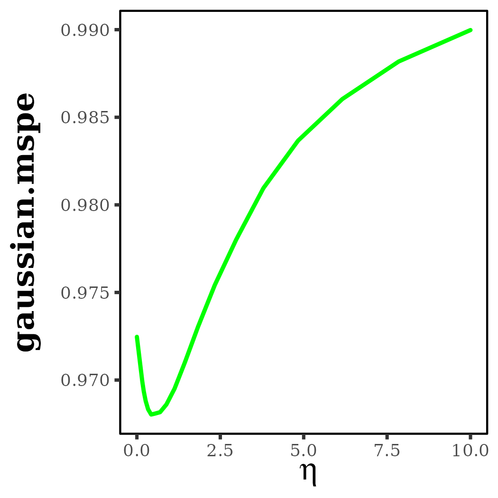
</div>


## Hyperparameter tuning of $\eta$ using Bayesian optimization

We implement Bayesian optimization based search strategy of the integration weight $\eta$ using the `rBayesianOptimization` package. This approach adaptively and iteratively proposes candidate values of $\eta$ by learning a surrogate model of the objective function, leading to a substantially higher sampling density in the neighborhood of the optimal integration weight compared with a fixed grid search.

Bayesian optimization in `BRIERfull` is accessed through the function `BRIERfull.bopt`. Users must specify the search range of the integration weight $\eta$ through the `bounds_list` argument, as well as the total number of Bayesian optimization iterations through `n_iter`. Additional required arguments are described below.

First, the score (objective) function is defined through the `criteria` argument. When an independent validation set is available, users should specify an appropriate predictive-performance metric, chosen according to the outcome distribution [Appendix](link) as the optimization objective. In this setting, the validation data must be supplied through the arguments `X.val` and `y.val`. 

Second, the acquisition function is specified via the acq argument. The available options, "ucb", "poi", and "EI", correspond to the Upper Confidence Bound (UCB), Probability of Improvement (POI), and Expected Improvement (EI) acquisition functions, respectively, as implemented in the `rBayesianOptimization` package. The default choice is "ucb".

Finally, the initial evaluation points for Bayesian optimization are controlled by the arguments `init_grid_dt` and `init_points`. If `init_grid_dt` is left empty, the algorithm initializes by randomly sampling `init_points` values of $\eta$ from the range specified in `bounds_list`. By default, a single initial point, `data.frame(eta = 1)`, is used for `init_grid_dt`. This choice reflects the fact that $\eta = 1$ corresponds to equal weighting between the target and external information and was observed in simulation studies to induce higher effective sampling density in the neighborhood of the optimal integration weight $\eta$.

```{r, echo = TRUE, eval = FALSE}
y_val = read.table("path/to/file")
X_val = read.table("path/to/file") %>% as.vector()
out = BRIERfull.bopt(
  X = pred,
  y = pheno,
  ind = ind,
  family = "gaussian",
  penalty = "LASSO",
  X.val = X_val, 
  y.val = y_val,
  criteria = "gaussian.mspe"
)

## Best eta and lambda based on Cp are reported
```

We also provide the function `plot.eta.density` to visualize the empirical density of the $\eta$ values explored during Bayesian optimization. This plot illustrates how the adaptive sampling strategy concentrates evaluations in regions with high objective values. The vertical red dotted line indicates the selected (optimal) integration weight $\eta$.

```{r, echo = TRUE, eval = FALSE}
plot.eta(out)
```

<div style="display: flex; justify-content: space-between;">
  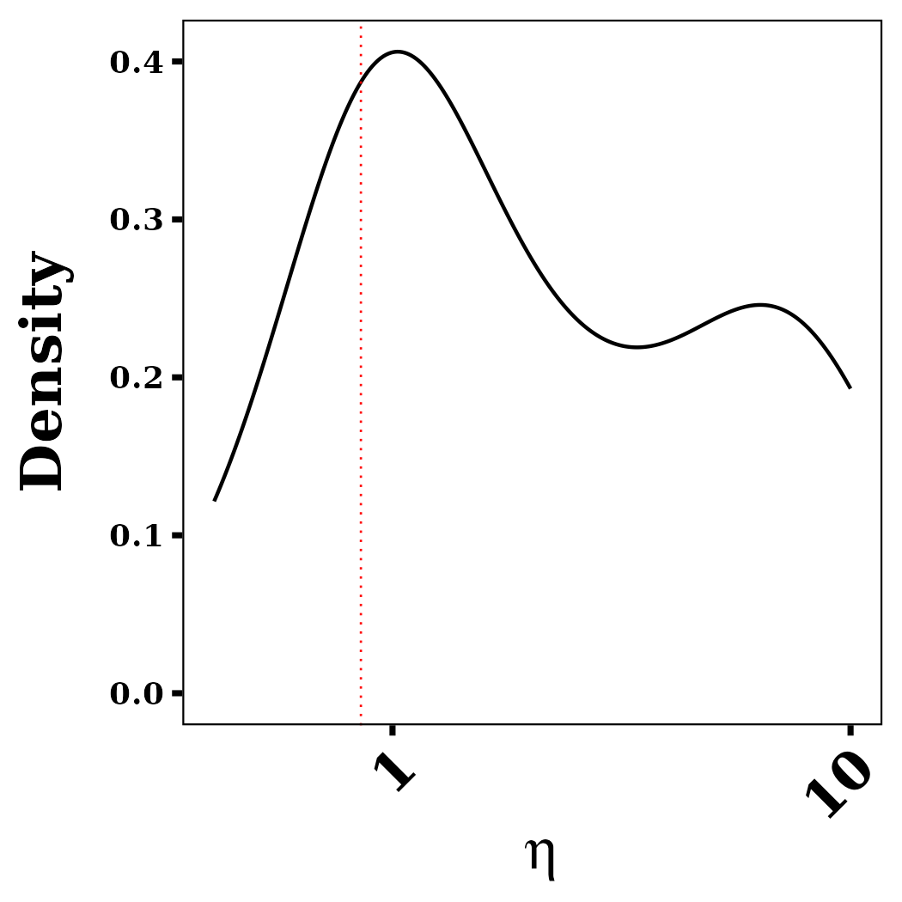
</div>


# `BRIERi`: modeling with individual-level target data and trained external models {#sec-BRIERi}

## Data format and preprocessing

`BRIERi` requires:  

- Individual-level predictor design matrix and phenotype data from the target cohort. 
- Pre-trained external models. External model must be provided from joint model coefficients (e.g., PRS, penalized regression). If only GWAS summary statistics or marginal predictor–trait inner products are available, users should instead refer to [BRIER.S](#sec-BRIERs) to train a joint model directly from summary-level data. Multiple external models can be provided as a column-stacked matrix.
- `BRIER.I` currently supports modeling of continous, binary, count, and time-to-event outcomes.

We begin by loading the package:

```{r, echo = TRUE, eval = FALSE}
library(BRIER2)
```

Below we import the phenotype and predictor matrix from target data and external model. Users should subset the predictors to those that are shared between the target and external models. We note that it is strongly recommended to train the external model using this shared set of predictors to minimize heterogeneity between the target and external data. When the external model is obtained from a published study (e.g., published PRS weights), users may reconstruct the external model by assigning coefficient values of zero to predictors that are present in the target data but absent from the external model, or vice versa.

```{r, echo = TRUE, eval = FALSE}

## Read data from target cohort
X_target = read.table("path/to/file")
y_target = read.table("path/to/file") %>% as.vector()
names(y_target) == rownames(X_target)
length(y_target) == nrow(X_target) # sample name and number of observation should be matched

## Read data from external model
beta = read.table("path/to/file") %>% as.vector()

## reconstruct beta so it matches colnames(X_target) exactly, filling unoverlapped (missing) coefficients with 0
beta_ext = setNames(numeric(ncol(X_target)), colnames(X_target))
beta_ext[intersect(names(beta), colnames(X_target))] = Ebeta[intersect(names(beta), colnames(X_target))]

head(pheno)
head(pred)
head(ind)
```


## Data preprocessing with polygenic risk modeling {#sec-PreprocessI}

We provide the helper function `PreprocessI` for polygenic risk modeling, where genotypes (SNPs) are used as predictors. The function `PreprocessI` harmonizes SNP definitions between the target data and external models by matching genomic positions and aligning effect alleles (with strand handling as needed).

```{r, echo = TRUE, eval = FALSE}
dat = PreprocessI(
  X.target, y.target, covar.target, standardize.target = T,
  ss.ext, type.ext, N.ext = NULL, LD.ext = NULL
  )
```

### Input format of target data

To process users should provide individual-level data from the target cohort, including genotype data, phenotype data, and predictor SNPs identifier.

Specifically, the required target inputs are:

- `X.target`: An individual-level genotype matrix of dimension $n\times p$, where n is the number of individuals and p is the number of SNPs. Genotypes should be coded numerically (e.g., 0/1/2 for allele counts).
- `y.target`: A vector of length n containing the phenotype of interest for the target cohort. The outcome type (continuous, binary, or count) should be compatible with the specified model family.
- `covar.target`: A data frame that includes SNP identifier information and, optionally, individual-level covariates. The SNP identifier component must contain columns CHR, BP, A1, and A2, where CHR denotes the chromosome, BP the genomic position, A1 the non-effect allele, and A2 the effect allele. These identifiers are used to construct SNP labels of the form "CHR:BP:A1:A2" and must correspond to the columns of X.target if presents. In addition, `covar.target` may include covariates (e.g., age, sex, ancestry principal components) with n rows, aligned with X.target and y.target. If no covariates are to be included, `covar.target` should contain only the SNP identifier columns.
- `standardize.target`: A logical indicator specifying whether the phenotype should be standardized after adjusting for covariates specified in `covar.target`. We note that in most PRS applications, external models are trained on standardized residual phenotypes; therefore, setting `standardize.target = TRUE` is generally recommended to ensure compatibility between the target data and the external model. If the external model is derived from an unstandardized phenotype and includes an intercept term, users may set `standardize.target = FALSE`. In this case, the model fitted by `BRIERi` will also include an intercept term.

```{r, echo = TRUE, eval = FALSE}
X = BEDMatrix("path.bed")
X = as.matrix(X)
y = read.table(XXX)
covar = read.table(XXX)
```

### Input format of external summary statistics

Users should provide the target summary statistics through the argument `ss.ext`. Three types of inputs are supported, as specified by the argument `type.ext`: 

- Option1: GWAS summary statistics (`type.ext` = "GWAS")
- Option2: SNP-wise (marginal) genotype-trait correlation (`type.ext` = "corr"); defined as $\boldsymbol X\boldsymbol y/n$, where $\boldsymbol X$, $\boldsymbol y$ can be either standardized or unstandardized).  
- Option3: Joint regression coefficient (`type.ext` = "coef").

We note that when summary statistics are provided under Option 1 or Option 2, the function will automatically estimate the joint regression coefficients using `BRIERs` with $\eta = 0$, and select tuning parameter $\lambda$ by $C_p$ criterion. In such case, the fitted external model is based on standardized phenotype and genotype and does not contain an intercept. In such cases, the argument `N.ext` must be provided to indicate the total sample size used to compute the external summary statistics, and the argument `LD.ext` is also required for modeling through `BRIERs`.

**Option 1: GWAS summary statistics from external data**

```{r, echo = TRUE, eval = FALSE}
N_ext = 100
type_ext = "GWAS"
ss_ext = read.table("Target.GWAS.txt", header = TRUE)
head(ss_ext)
```

The target GWAS summary statistics provided through `ss.ext` must contain the following information:

- `CHR`: chromosome
- `BP`: genomic position
- `A1`: non-effect allele
- `A2`: effect allele
- `S` (effect direction) or `BETA` (effect size)
- `N`: per-SNP sample size used in the GWAS
- `P`: marginal GWAS p-value

If the column names in the input file differ from the defaults listed above, users may explicitly specify the corresponding column names using the arguments `ext.CHR.name`, `ext.BP.name`, `ext.A1.name`, `ext.A2.name`, `ext.S.name`, `ext.BETA.name`, `ext.N.name`, `ext.P.name` in `PreprocessS`.

**Option 2: SNP-wise genotype–trait correlation from external data**

```{r, echo = TRUE, eval = FALSE}
N_ext = 100
type_ext = "corr"
ss_ext = read.table("Target.Corr.txt", header = TRUE)
head(ss_ext)
```

The target GWAS summary statistics provided through `ss.ext` must contain the following information:

- `CHR`: chromosome
- `BP`: genomic position
- `A1`: non-effect allele
- `A2`: effect allele
- `corr`: SNP-wise marginal correlation

If the column names in the input file differ from the defaults listed above, users may explicitly specify the corresponding column names using the arguments `ext.CHR.name`, `ext.BP.name`, `ext.A1.name`, `ext.A2.name`, `ext.corr.name` in `PreprocessS`.

**Option 3: Joint regression coefficient estimate from external data**

```{r, echo = TRUE, eval = FALSE}
N_ext = NULL
type_ext = "CORR"
ss_ext = read.table("Target.Corr.txt", header = TRUE)
head(ss_ext)
```

The external GWAS summary statistics provided through `ss.ext` must contain the following information:

- `CHR`: chromosome
- `BP`: genomic position
- `A1`: non-effect allele
- `A2`: effect allele
- `coef`: joint coefficient estimate

If the column names in the input file differ from the defaults listed above, users may explicitly specify the corresponding column names using the arguments `ext.CHR.name`, `ext.BP.name`, `ext.A1.name`, `ext.A2.name`, `ext.coef.name` in `PreprocessI`.

### Run `PreprocessI`

With the summary statistics from the target and external datasets prepared as described above, we now run `PreprocessI` to perform the required data preprocessing. The function output a list, containing `X` for processed target design matrix, `y` for processed target phenotype, `beta.ext` for processed external trained model.

```{r, echo = TRUE, eval = FALSE}
dat = PreprocessI(
  X.target = X_target, y.target = y_target, covar.target = covar_target, standardize.target = T,
  ss.ext = ss_ext, type.ext = type_ext, N.ext = N_ext, LD.ext = LD_ext
  )
```

## Fitting `BRIERi`

Once preprocessing is complete, a `BRIER.I` model can be fitted directly. Below we describe the main input arguments of `BRIERi`.

- **`X`**: Individual-level predictor matrix from the target cohort.
- **`y`**: Individual-level outcome vector from the target cohort.
- **`beta.external`**: A vector of pretrained model coefficients from the external cohort(s), including the intercept term.
- **`family`**: Outcome distribution family. Supported options include `"gaussian"`, `"binomial"`, `"poisson"`, and `"negbin"`. Additional details are provided in the [Appendix](link). The default is `"gaussian"`.
- **`penalty`**: Penalty function used for regularized estimation. Supported options include `"LASSO"`, `"MCP"`, and `"SCAD"`. The default is `"LASSO"`.
- **`eta_vec`**: A vector of integration-weight parameters `eta` controlling the degree of information borrowing from the external cohort(s).


```{r, echo = TRUE, eval = FALSE}
fit <- BRIERi(
    X = dat$X, 
    y = dat$y, 
    beta.external = dat$beta.external,
    eta_vec = exp(seq(0, log(10), length = 20))    
    family = "gaussian",
    penalty = "LASSO"
)
```


## Hyperparameters

The \texttt{BRIER2} framework involves two classes of hyperparameters: the regularization parameter $\lambda$ and the integration weights $\{\eta_m\}_{m=1}^M$. For the regularization parameter $\lambda$, we adopt the classic regularization path strategy implemented in package \texttt{ncvreg} \citep{Breheny2011_ncvreg}, and provide a data-driven sequence of $\lambda$ for each $\eta$ value. By default, the maximum value of $\lambda$ is defined as the smallest value at which all predictors are excluded from the model, while the minimum value is set to $0.001 \times \lambda_{\max}$. A sequence of 100 equally spaced values on the log scale is used to construct the $\lambda$ grid, unless otherwise specified by the user.


## Hyperparameter tuning of $\eta$ using grid search {#sec-BRIERi.selection}

We first introduce search strategy of integration weights $\eta$ using a user-specified fixed sequence. By default, the $\eta$ grid is defined as exp\{seq(log(0.1), log(10), length = 20)\}. `BRIERi` provides three criterion to evaluate each candidate pair of hyperparameters $(\eta, \lambda)$: cross-validation, evaluation on an independent validation set, and information-based criteria. The function `BRIERi.cv` performs cross-validation on the training data, using the predicted deviance as evaluation criteria, with the specific deviance definition provided in [Appendix](LINK)

```{r, echo = TRUE, eval = FALSE}
fit = BRIERi.cv(
    X = dat$X, 
    y = dat$y, 
    beta.external = dat$beta.external,
    eta = exp(seq(0, log(10), length = 20))    
    family = "gaussian",
    penalty = "LASSO"
)
```

`BRIERi.selection` can also select the optimal hyper-parameters if an independent validation set is provided. Below displays an example of using MSPE as evaluation metric for continuous outcome. Additional evaluation metrics for different outcomes are provided in the [Appendix](LINK).    

```{r, echo = TRUE, eval = FALSE}
X_val = read.table("path/to/file")
y_val = read.table("path/to/file") %>% as.vector()
out = BRIERi.selection(
  fit = fit,
  X.val = X_val, 
  y.val = y_val,
  criteria = "gaussian.mspe"
)

## Best eta and lambda based on Cp are reported
```

For continuous, binary, and count outcomes, users can also utilize information-based criteria to tune the optimal hyperparameters \((\eta, \lambda)\). We implemented Bayesian information criteria (BIC; specified by argument `criteria = "BIC"`), Mallow's $C_p$ ($C_p$; specified by argument `criteria == "Cp"`), and generalized cross validation (GCV; specified by argumet `criteria = "gcv"`). The required arguments of different tuning methods are summarized in the table below. Detailed formula of information criteria is summarized in [Appendix](LINK).

Table: (\#tab:BRIERi.selection) Required arguments for different hyperparameter tuning methods in `BRIERi.selection`.

| **Tuning method** | **Criteria argument** | **Required inputs** | **Typical usage** |
|:--|:--|:--|:--|
| Bayesian Information Criterion (BIC) | `criteria = "BIC"` | `X`, `y`, `BRIERi.obj` | `BRIERi.selection(X, y, BRIERi.obj, criteria = "BIC")` |
| Generalized Cross-Validation (GCV) | `criteria = "gcv"` | `X`, `y`, `BRIERi.obj` | `BRIERi.selection(X, y, BRIERi.obj, criteria = "gcv")` |
| Mallows' $C_p$ | `criteria = "Cp"` | `X`, `y`, `BRIERi.obj` | `BRIERi.selection(X, y, BRIERi.obj, criteria = "Cp")` |

Based on extensive simulation studies and real-data applications, we recommend Mallows’ $C_p$, as it consistently achieves better predictive performance.

```{r, echo = TRUE, eval = FALSE}
X_val = read.table("path/to/file")
y_val = read.table("path/to/file") %>% as.vector()
out = BRIERi.selection(
  fit = fit,
  criteria = "Cp"
)

## Best eta and lambda based on Cp are reported
```

The function `plot.eta` can be used to guide and visualize the selection of the optimal integration weight $\eta$ based on predictive performance under different evaluation metrics from cross-validation and an independent validation set, or based on information-criterion values. The left panel displays the predictive performance (here, MSPE for a Gaussian outcome) evaluated on the validation set as a function of $\eta$, while the right panel shows the corresponding information-criterion curve (e.g., Cp). The optimal integration weight is identified as the value of $\eta$ that minimizes (or maximizes, depending on the metric) the evaluation criterion.

```{r, echo = TRUE, eval = FALSE}
plot.eta(out)
```

<div style="display: flex; justify-content: space-between;">
  
  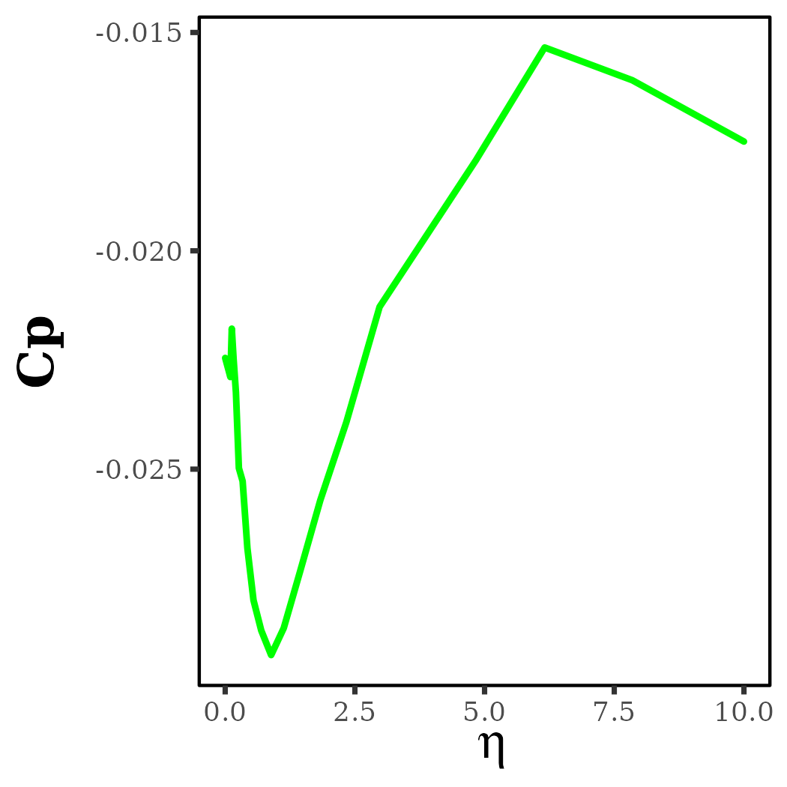
</div>


## Hyperparameter tuning of $\eta$ using Bayesian optimization

We implement Bayesian optimization–based search strategy of the integration weight $\eta$ using the `rBayesianOptimization` package. This approach adaptively and iteratively proposes candidate values of $\eta$ by learning a surrogate model of the objective function, leading to a substantially higher sampling density in the neighborhood of the optimal integration weight compared with a fixed grid search.

Bayesian optimization in `BRIERi` is accessed through the function `BRIERi.bopt`. Users must specify the search range of the integration weight $\eta$ through the `bounds_list` argument, as well as the total number of Bayesian optimization iterations through `n_iter`. Additional required arguments are described below.

First, the score (objective) function is defined through the `criteria` argument. When an independent validation set is available, users should specify an appropriate predictive-performance evaluation metric, chosen according to the outcome distribution [evaluation metrics](#sec-distr) as the optimization objective. In this setting, the validation data must be supplied through the arguments `X.val` and `y.val`. Alternatively, Bayesian optimization can be performed using information-based criteria as the objective function, without requiring a validation set. In this case, the criteria argument should be set to one of the supported information criteria listed in Table \@ref(tab:BRIERi.selection), and the corresponding quantities are computed internally from the target data.

Second, the acquisition function is specified via the acq argument. The available options, "ucb", "poi", and "EI", correspond to the Upper Confidence Bound (UCB), Probability of Improvement (POI), and Expected Improvement (EI) acquisition functions, respectively, as implemented in the `rBayesianOptimization` package. The default choice is "ucb".

Finally, the initial evaluation points for Bayesian optimization are controlled by the arguments `init_grid_dt` and `init_points`. If `init_grid_dt` is left empty, the algorithm initializes by randomly sampling `init_points` values of $\eta$ from the range specified in `bounds_list`. By default, a single initial point, `data.frame(eta = 1)`, is used for `init_grid_dt`. This choice reflects the fact that $\eta = 1$ corresponds to equal weighting between the target and external information and was observed in simulation studies to induce higher effective sampling density in the neighborhood of the optimal integration weight $\eta$.

Below are examples of using the prediction performance on validation set as the score function:

```{r, echo = TRUE, eval = FALSE}
y_val = read.table("path/to/file")
X_val = read.table("path/to/file") %>% as.vector()
out = BRIERi.bopt(
  X = pred,
  y = pheno,
  family = "gaussian",
  penalty = "LASSO",
  X.val = X_val, 
  y.val = y_val,
  criteria = "gaussian.mspe"
)

## Best eta and lambda based on Cp are reported
```

Below are examples of using the Cp criteria as the score function:

```{r, echo = TRUE, eval = FALSE}
y_val = read.table("path/to/file")
X_val = read.table("path/to/file") %>% as.vector()
out = BRIERi.bopt(
  X = pred,
  y = pheno,
  family = "gaussian",
  penalty = "LASSO",
  criteria = "Cp"
)

## Best eta and lambda based on Cp are reported
```

We also provide the function `plot.eta.density` to visualize the empirical density of the $\eta$ values explored during Bayesian optimization. This plot illustrates how the adaptive sampling strategy concentrates evaluations in regions with high objective values. The vertical red dotted line indicates the selected (optimal) integration weight $\eta$.

```{r, echo = TRUE, eval = FALSE}
plot.eta(out)
```

<div style="display: flex; justify-content: space-between;">
  
</div>


# `BRIERs`: modeling using summary level target and external data {#sec-BRIERs}

When only summary statistics are available for the target and external cohorts, `BRIER.S` provides a flexible framework for integrating target and external information using Bregman divergence. The most common source of such summary statistics is marginal GWAS analyses of the trait of interest and `BRIERs` model the polygenic risk of the trait of interest.

`BRIERs` requires

- A vector of marginal correlation between outcome and each predictors.
- Reference predictor $\boldsymbol{X}$
- Pre-trained external models. External model must be provided from joint model coefficients (e.g., PRS, penalized regression). If only GWAS summary statistics or marginal predictor–trait inner products are available, users should instead refer to [BRIER.S](#sec-BRIERs) to train a joint model directly from summary-level data. Multiple external models can be provided as a column-stacked matrix.
- `BRIER.S` currently supports modeling of continous, binary, and count outcomes.


## Data format and preprocessing {#sec-PreprocessS}

We provide the helper function `PreprocessS` for standard data preprocessing in `BRIERs` modeling. The function `PreprocessS` performs the following tasks:

- Remove SNPs that are not present in the reference LD panel
- Align genomic build and effect alleles of external summary statistics to that of target reference data
- Convert GWAS summary statistics from the target data into marginal SNP–trait correlations, when required
- Convert GWAS summary statistics from the external data into joint PRS coefficient estimates, when required

```{r, echo = TRUE, eval = FALSE}
dat = PreprocessS(
  ss.target, type.target, N.target, LD.target, 
  ss.ext, type.ext, N.ext, LD.ext
  )
```

The arguments `ss.target`, `type.target`, `N.target`, `LD.target` are for target data, while `ss.ext`, `type.ext`, `N.ext`, `LD.ext` are for external data. The required input format are summarized in the table below. we describe the required summary statistics input format for target and external data in the following subsections.

Table: (\#tab:BRIERs) Required summary-level input data formats for `PreprocessS`.

| **Source** | **Required data** | **Input argument** | **Indicator argument** | **Format** |
|:--|:--|:--|:--|:--|
| target | GWAS summary statistics, including sample size, association direction, and p-values. | `ss.target` | `type.target = "GWAS"` | `data.frame` |
| target | SNP-wise marginal genotype--trait correlations. | `ss.target` | `type.target = "corr"` | `data.frame` |
| External | GWAS summary statistics, including effect direction (or effect size), sample size, and marginal p-values. | `ss.ext` | `type.ext = "GWAS"` | `data.frame` |
| External | SNP-wise marginal genotype--trait correlations. | `ss.ext` | `type.ext = "corr"` | `data.frame` |
| External | Joint coefficient estimates derived from external data. | `ss.ext` | `type.ext = "coef"` | `data.frame` |
| LD | Package-provided LD reference panels based on the 1000 Genomes Project (default). | `LD.target` or `LD.ext` | --- | RDS files containing sparse matrices |
| LD | User-specified LD reference panels. | `LD.target` or `LD.ext` | --- | RDS files containing sparse matrices |


### Input format of target summary statistics

Users should provide the target summary statistics through the argument `ss.target`. Two types of inputs are supported, as specified by the argument `type.target`: 

- Option1: GWAS summary statistics (`type.target` = "GWAS")
- Option2: SNP-wise (marginal) genotype-trait correlation (type.target = "corr"); defined as $\boldsymbol X\boldsymbol y/n$, where $\boldsymbol X$, $\boldsymbol y$ can be either standardized or unstandardized).  

The argument `N.target` should be provided to indicate the total sample size used to compute the target summary statistics.

**Option 1: GWAS summary statistics from target data**

```{r, echo = TRUE, eval = FALSE}
N_target = 100
type_target = "GWAS"
ss_target = read.table("Target.GWAS.txt", header = TRUE)
head(ss_target)
```

The target GWAS summary statistics provided through `ss.target` must contain the following information:

- `CHR`: chromosome
- `BP`: genomic position
- `A1`: non-effect allele
- `A2`: effect allele
- `S` (effect direction) or `BETA` (effect size)
- `N`: per-SNP sample size used in the GWAS
- `P`: marginal GWAS p-value

If the column names in the input file differ from the defaults listed above, users may explicitly specify the corresponding column names using the arguments `target.CHR.name`, `target.BP.name`, `target.A1.name`, `target.A2.name`, `target.S.name`, `target.BETA.name`, `target.N.name`, `target.P.name` in `PreprocessS`.

**Option 2: SNP-wise genotype–trait correlation  from target data**

```{r, echo = TRUE, eval = FALSE}
N_target = 100
type_target = "corr"
ss_target = read.table("Target.Corr.txt", header = TRUE)
head(ss_target)
```

The target GWAS summary statistics provided through `ss.target` must contain the following information:

- `CHR`: chromosome
- `BP`: genomic position
- `A1`: non-effect allele
- `A2`: effect allele
- `corr`: SNP-wise marginal correlation

If the column names in the input file differ from the defaults listed above, users may explicitly specify the corresponding column names using the arguments `target.CHR.name`, `target.BP.name`, `target.A1.name`, `target.A2.name`, `target.corr.name` in `PreprocessS`.

**LD reference panel**

Users should provide linkage disequilibrium (LD) reference matrices for the target population through the argument `LD.target`. Each LD matrix must have matching row and column names corresponding to SNPs, formatted exactly as "CHR:BP:A1:A2", where CHR denotes the chromosome, BP the genomic position, A1 the non-effect allele, and A2 the effect allele. Details on the construction of LD reference panels are provided in [Section 8.2](#sec-LD).

```{r, echo = TRUE, eval = FALSE}
LD_target = readRDS(XXX)
```


### Input format of external summary statistics

Users should provide the target summary statistics through the argument `ss.ext`. Three types of inputs are supported, as specified by the argument `type.ext`: 

- Option1: GWAS summary statistics (`type.ext` = "GWAS")
- Option2: SNP-wise (marginal) genotype-trait correlation (`type.ext` = "corr"); defined as $\boldsymbol X\boldsymbol y/n$, where $\boldsymbol X$, $\boldsymbol y$ can be either standardized or unstandardized).  
- Option3: Joint regression coefficient (`type.ext` = "coef").

We note that when summary statistics are provided under Option 1 or Option 2, the function will automatically estimate the joint regression coefficients using `BRIERs` with $\eta = 0$, and select tuning parameter $\lambda$ by $C_p$ criterion. In such cases, the argument `N.ext` must be provided to indicate the total sample size used to compute the external summary statistics, and the argument `LD.ext` is also required for modeling through `BRIERs`.

**Option 1: GWAS summary statistics from external data**

```{r, echo = TRUE, eval = FALSE}
N_ext = 100
type_ext = "GWAS"
ss_ext = read.table("Target.GWAS.txt", header = TRUE)
head(ss_ext)
```

The target GWAS summary statistics provided through `ss.ext` must contain the following information:

- `CHR`: chromosome
- `BP`: genomic position
- `A1`: non-effect allele
- `A2`: effect allele
- `S` (effect direction) or `BETA` (effect size)
- `N`: per-SNP sample size used in the GWAS
- `P`: marginal GWAS p-value

If the column names in the input file differ from the defaults listed above, users may explicitly specify the corresponding column names using the arguments `ext.CHR.name`, `ext.BP.name`, `ext.A1.name`, `ext.A2.name`, `ext.S.name`, `ext.BETA.name`, `ext.N.name`, `ext.P.name` in `PreprocessS`.

**Option 2: SNP-wise genotype–trait correlation from external data**

```{r, echo = TRUE, eval = FALSE}
N_ext = 100
type_ext = "corr"
ss_ext = read.table("Target.Corr.txt", header = TRUE)
head(ss_ext)
```

The target GWAS summary statistics provided through `ss.ext` must contain the following information:

- `CHR`: chromosome
- `BP`: genomic position
- `A1`: non-effect allele
- `A2`: effect allele
- `corr`: SNP-wise marginal correlation

If the column names in the input file differ from the defaults listed above, users may explicitly specify the corresponding column names using the arguments `ext.CHR.name`, `ext.BP.name`, `ext.A1.name`, `ext.A2.name`, `ext.corr.name` in `PreprocessS`.

**Option 3: Joint regression coefficient estimate from external data**

```{r, echo = TRUE, eval = FALSE}
N_ext = NULL
type_ext = "coef"
ss_ext = read.table("Target.coef.txt", header = TRUE)
head(ss_ext)
```

The external GWAS summary statistics provided through `ss.ext` must contain the following information:

- `CHR`: chromosome
- `BP`: genomic position
- `A1`: non-effect allele
- `A2`: effect allele
- `coef`: joint coefficient estimate

If the column names in the input file differ from the defaults listed above, users may explicitly specify the corresponding column names using the arguments `ext.CHR.name`, `ext.BP.name`, `ext.A1.name`, `ext.A2.name`, `ext.coef.name` in `PreprocessS`.

**LD reference panel**

Users should provide linkage disequilibrium (LD) reference matrices for the exterbak population through the argument `LD.ext`. Each LD matrix must have matching row and column names corresponding to SNPs, formatted exactly as "CHR:BP:A1:A2", where CHR denotes the chromosome, BP the genomic position, A1 the non-effect allele, and A2 the effect allele. Details on the construction of LD reference panels are provided in [Section 8.2](#sec-LD).

```{r, echo = TRUE, eval = FALSE}
LD_target = readRDS(XXX)
```

### Run `PreprocessS`

With the summary statistics from the target and external datasets prepared as described above, we now run `PreprocessS` to perform the required data preprocessing. The function output a list, containing `GWAS_sum` for processed target summary statistics, `XtX` for processed target LD matrix, `beta.ext` for processed external trained model.

```{r, echo = TRUE, eval = FALSE}
dat = PreprocessS(
  ss.target = ss_target, type.target = type_target, N.target = N_target, LD.target = LD_target, 
  ss.ext = ss_ext, type.ext = type_ext, N.ext = N_ext, LD.ext = LD_ext
)
```


## LD calculation {#sec-LD}

In this section, we introduce how to obtain LD reference matrix for `BRIERs` modeling. Additional details are provided in [Appendix](LINK).

### Built-in LD matrix from 1000 Genome

`BRIER2` package provide built in LD matrix calculated from 1000 Genome for African (AFR), European (EUR), East Asian (EAS), South Asian (Asian), and Admixed American (AMR), in either hg19 or hg38 genomic coordinates. We provide function `load_LD` to load this LD matrix. Each loaded LD object is a sparse matrix in R, with matched row and column names corresponding to SNP identifiers formatted as "CHR:BP:A1:A2".

```{r, echo = TRUE, eval = FALSE}
LD_target = load_LD(
  population = "AFR",
  build = "hg38", 
  reference = "1000G"
)
```

### Calculating LD matrix from user specified panels in R

In addition to the built-in LD reference panels provided by `BRIER2`, users may construct custom LD matrices from their own genotype reference data. This option is particularly useful when a study-specific reference panel is preferred or the target population is not well represented in the 1000 Genomes Project.

Below, we illustrate how to compute LD matrices in R using genotype data stored in PLINK binary format (.bed/.bim/.fam) via the function `cal.LD`. The function requires SNP identifiers as "CHR:BP:A1:A2" format supplied through the argument `ref.ID`, genotype data supplied through the argument `ref.X`, and LD block definitions supplied through the argument `LDB`. The `BRIER2` package provides predefined LD block definitions based on the study by [Berisa and Pickrell (2015)](https://academic.oup.com/bioinformatics/article/32/2/283/1743626/Approximately-independent-linkage-disequilibrium)).

```{r, echo = TRUE, eval = FALSE}

X = BEDMatrix("path.bed")
X = as.matrix(X)
ID = fread("path.bim")$V3
blocks = read.table(paste0("../package_scripts/BRIER/inst/data/Berisa.", race1, ".hg38.bed",sep = ""), header = T)
blocks[,1] = as.numeric(sapply(strsplit(blocks[,1],"chr"), function(x){x[2]}))
blocks = as.matrix(blocks)

LD_target = cal.LD(
  ref.X = X, ref.ID = ID, 
  LDB = blocks, tau = 0
  )

```

### Calculating LD matrix from imputed genotypes in command line

In many large-scale genetic studies, genotypes are available in imputed format. However, directly loading large imputed genotype datasets into R can be memory intensive and computationally inefficient. To address this limitation, we provide a memory-efficient command-line tool, cal.LD.sh, for computing LD matrices directly from imputed genotypes without requiring them to be fully loaded into R.

The script cal.LD.sh computes LD matrices within predefined LD blocks and outputs them as sparse matrices that are directly compatible with downstream BRIER2 workflows. The tool requires (i) the path to the imputed genotype data in PLINK2 format (.pgen/.pvar/.psam) and (ii) the path to the LD block definition file (e.g., Berisa–Pickrell LD blocks).

```{r, echo = TRUE, eval = FALSE}
# Scripts to be added
```


## Fitting `BRIER.S`

Once preprocessing is completed, `BRIER.S` model can be fitted directly. Below we describe the main input arguments of `BRIERs`.

- **`GWAS_sum`**: A data frame containing summary-level marginal correlation statistics from the target cohort.
- **`X`**: Reference genotype matrix from the target cohort, used to estimate the reference correlation structure (e.g., the LD matrix).
- **`beta.external`**: A vector of pretrained model coefficients from the external cohort(s). The external cohort provided should not include the intercept term.
- **`penalty`**: Penalty function used for regularized estimation. Supported options include `"LASSO"`, `"MCP"`, and `"SCAD"`. The default is `"LASSO"`.
- **`eta_vec`**: A vector of integration-weight parameters `eta` controlling the degree of information borrowing from the external cohort(s).

```{r, echo = TRUE, eval = FALSE}
fit <- BRIERs(
    GWAS_sum = dat$GWAS_sum, 
    X = dat$X, 
    beta.external = dat$beta.external,
    eta_vec = exp(seq(0, log(10), length = 20)
    )
```


## Hyperparameters

The \texttt{BRIER2} framework involves two classes of hyperparameters: the regularization parameter $\lambda$ and the integration weights $\{\eta_m\}_{m=1}^M$. For the regularization parameter $\lambda$, we adopt the classic regularization path strategy implemented in package \texttt{ncvreg} \citep{Breheny2011_ncvreg}, and provide a data-driven sequence of $\lambda$ for each $\eta$ value. By default, the maximum value of $\lambda$ is defined as the smallest value at which all predictors are excluded from the model, while the minimum value is set to $0.001 \times \lambda_{\max}$. A sequence of 100 equally spaced values on the log scale is used to construct the $\lambda$ grid, unless otherwise specified by the user.


## Hyperparameter tuning of $\eta$ using grid search {#sec-BRIERs.selection}

We first introduce search strategy of integration weights $\eta$ using a user-specified fixed sequence. By default, the $\eta$ grid is defined as exp\{seq(log(0.1), log(10), length = 20)\}. `BRIERs` provides two criterion to evaluate each candidate pair of hyperparameters $(\eta, \lambda)$: evaluation on an independent validation set, and information-based criteria. `BRIERs.selection` can select the optimal hyper-parameters if an independent validation set is provided. Below displays an example of using MSPE as evaluation metric for continuous outcome. Additional evaluation metrics for different outcomes are provided in the [Appendix](LINK).   

```{r, echo = TRUE, eval = FALSE}

X_val = read.table("path/to/file")
y_val = read.table("path/to/file") %>% as.vector()
out = BRIERs(
  model = fit, 
  criteria = "gaussian.mspe", 
  X.val = X_val,
  y.val = y_val
  )
## Best eta based on MSPE is 2.10
## Best lambda based on MSPE is 0.07
## Best eta based on Cp is 0.12
## Best lambda based on Cp is 0.094
```

When an independent validation set is not available, users may rely on information-based criteria to tune the optimal hyperparameters \((\eta, \lambda)\). We implemented Generalized information criteria (GIC; specified by argument `criteria = "GIC"`), Mallow's $C_p$ ($C_p$; specified by argument `criteria == "Cp"`), and pseudo-validation (GCV; specified by argument `criteria = "pseu.val"`). The required arguments of different tuning methods are summarized in the table below. Detailed formula of information criteria is summarized in [Appendix](LINK).

Table: (\#tab:BRIERs.selection) Required arguments for different hyperparameter tuning methods in `BRIERs.selection`.

| **Tuning strategy** | **Criteria argument** | **Required arguments** | **Typical usage** |
|:--|:--|:--|:--|
| Cp-type criterion | `criteria = "Cp"` | `BRIERs.obj`, `TN`, `h2` | `BRIERs.selection(BRIERs.obj = model, TN = nrow(X_training), h2 = 0, criteria = "Cp")` |
| Pseudo-validation | `criteria = "pseu_val"` | `BRIERs.obj`, `XtX`, `GWAS_sum` | `BRIERs.selection(BRIERs.obj = model, XtX = model$XtX, GWAS_sum = GWAS_training, criteria = "pseu_val")` |
| Generalized Information Criterion (GIC) | `criteria = "GIC"` | `BRIERs.obj`, `TN`, `h2` | `BRIERs.selection(BRIERs.obj = model, TN = nrow(X_training), h2 = 0, criteria = "GIC")` |

Here `TN` denotes the sample size of the target data, `h2` denotes the phenotype heritability used in information-criterion-based tuning, `XtX` denotes the linkage disequilibrium (LD) matrix estimated from the target data, and `GWAS_sum` denotes the GWAS summary statistics from the target data.

Based on extensive simulation studies and real-data applications, we recommend $GIC$, as it consistently achieves better predictive performance.

```{r, echo = TRUE, eval = FALSE}
out <- BRIERs(
    model = fit, 
    criteria = "GIC", 
    TN = dat$TN,
    h2 = dat$h2
    )
```

The function `plot.eta` can be used to guide and visualize the selection of the optimal integration weight $\eta$ based on predictive performance under different evaluation metrics from an independent validation set, or based on information-criterion values. The left panel displays the predictive performance (here, MSPE for a Gaussian outcome) evaluated on the validation set as a function of $\eta$, while the right panel shows the corresponding information-criterion curve (e.g., GIC). The optimal integration weight is identified as the value of $\eta$ that minimizes (or maximizes, depending on the metric) the evaluation criterion.

```{r, echo = TRUE, eval = FALSE}
plot.eta(out)
```

<div style="display: flex; justify-content: space-between;">
  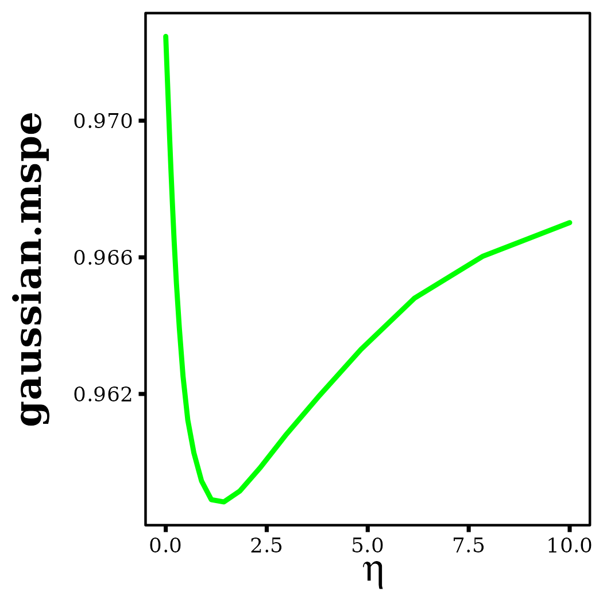
  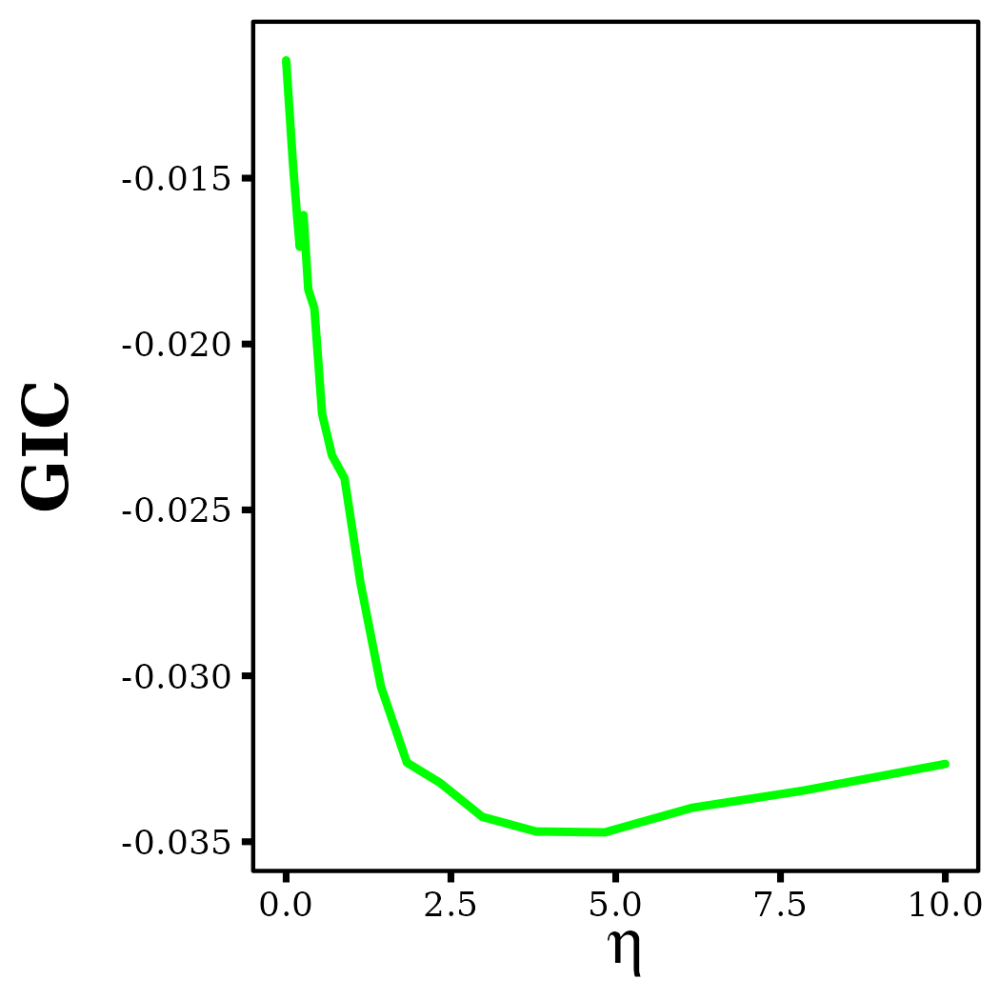
</div>

## Hyperparameter tuning of $\eta$ using Bayesian optimization

We implement Bayesian optimization–based tuning of the integration weight $\eta$ using the `rBayesianOptimization` package. This approach adaptively and iteratively proposes candidate values of $\eta$ by learning a surrogate model of the objective function, leading to a substantially higher sampling density in the neighborhood of the optimal integration weight compared with a fixed grid search.

Bayesian optimization in `BRIERsl` is accessed through the function `BRIERs.bopt`. Users must specify the search range of the integration weight $\eta$ through the `bounds_list` argument, as well as the total number of Bayesian optimization iterations through `n_iter`. Additional required arguments are described below.

First, the score (objective) function is defined through the `criteria` argument. When an independent validation set is available, users should specify an appropriate predictive-performance metric, chosen according to the outcome distribution [evaluation metrics](#sec-distr) as the optimization objective. In this setting, the validation data must be supplied through the arguments `X.val` and `y.val`. Alternatively, Bayesian optimization can be performed using information-based criteria as the objective function, without requiring a validation set. In this case, the criteria argument should be set to one of the supported information criteria listed in Table \@ref(tab:BRIERs.selection), and the corresponding quantities are computed internally from the target data.

Second, the acquisition function is specified via the acq argument. The available options, "ucb", "poi", and "EI", correspond to the Upper Confidence Bound (UCB), Probability of Improvement (POI), and Expected Improvement (EI) acquisition functions, respectively, as implemented in the `rBayesianOptimization` package. The default choice is "ucb".

Finally, the initial evaluation points for Bayesian optimization are controlled by the arguments `init_grid_dt` and `init_points`. If `init_grid_dt` is left empty, the algorithm initializes by randomly sampling `init_points` values of $\eta$ from the range specified in `bounds_list`. By default, a single initial point, `data.frame(eta = 1)`, is used for `init_grid_dt`. This choice reflects the fact that $\eta = 1$ corresponds to equal weighting between the target and external information and was observed in simulation studies to induce higher effective sampling density in the neighborhood of the optimal integration weight $\eta$.

Below are examples of using the prediction performance on validation set as the score function:

```{r, echo = TRUE, eval = FALSE}
y_val = read.table("path/to/file")
X_val = read.table("path/to/file") %>% as.vector()
out = BRIERs.bopt(
  X = pred,
  y = pheno,
  ind = ind,
  family = "gaussian",
  penalty = "LASSO",
  criteria = "gaussian.mspe",
  X.val = X_val, 
  y.val = y_val
)

## Best eta and lambda based on Cp are reported
```

Below are examples of using the GIC criteria as the score function:

```{r, echo = TRUE, eval = FALSE}
y_val = read.table("path/to/file")
X_val = read.table("path/to/file") %>% as.vector()
out = BRIERs.bopt(
  X = pred,
  y = pheno,
  ind = ind,
  family = "gaussian",
  penalty = "LASSO",
  criteria = "GIC", 
  TN = dat$TN,
  h2 = dat$h2
)

## Best eta and lambda based on Cp are reported
```


We also provide the function `plot.eta.density` to visualize the empirical density of the $\eta$ values explored during Bayesian optimization. This plot illustrates how the adaptive sampling strategy concentrates evaluations in regions with high objective values. The vertical red dotted line indicates the selected (optimal) integration weight $\eta$.

```{r, echo = TRUE, eval = FALSE}
plot.eta(out)
```

<div style="display: flex; justify-content: space-between;">
  
</div>


# Handling multiple external model {#sec-multiple}

`BRIER2` provides two adaptive weighting strategies for integrating multiple external models: a PCA-based approach and an ensemble-based approach, implemented in the functions `BRIERi.multi` and `BRIERs.multi` for individual-level and summary-level target data, respectively. This strategies substantially reduce computational burden by collapsing the multidimensional penalty space into a one-dimensional tuning parameter combined with an estimated ensemble weight. This strategy avoids computationally intensive joint optimization over multiple external-model hyperparameters while retaining flexible information borrowing across sources.

The choice of aggregation strategy is controlled by the `aggregate` argument, where "pca" specifies the PCA-based weighting method and "ensemble" specifies the ensemble-based weighting method. We recommend using the ensemble based strategy as in comprehensive simulation and real data analysis it achieves comparable prediction performance with the gold standard approach, which jointly tunes a separate integration weight for each external model. Methodological details are provided in the [Appendix](LINK).


## Before integrating all external models to the target data

Users may have access to multiple external models; however, it is often undesirable to include all of them in the final integration. Some external models may be well aligned with the target data and improve predictive performance, whereas others may be highly heterogeneous and provide little or no benefit.

In such cases, users may first integrate each external model individually with the target data and evaluate predictive performance on a testing set. The function `plot.eta` can be used to visualize model performance as a function of the integration weight $\eta$, thereby diagnosing the degree of heterogeneity between the target data and each external model (see [Section 10.1](#sec-eval)).

In the example below, three `BRIER2` models are fitted by integrating different external models with the same target dataset. The model corresponding to the dashed light-green curve shows no improvement in predictive MSPE across values of $\eta$, indicating substantial heterogeneity with the target data. Consequently, users may reasonably exclude this external model when jointly integrating multiple sources using `BRIER.multi`.

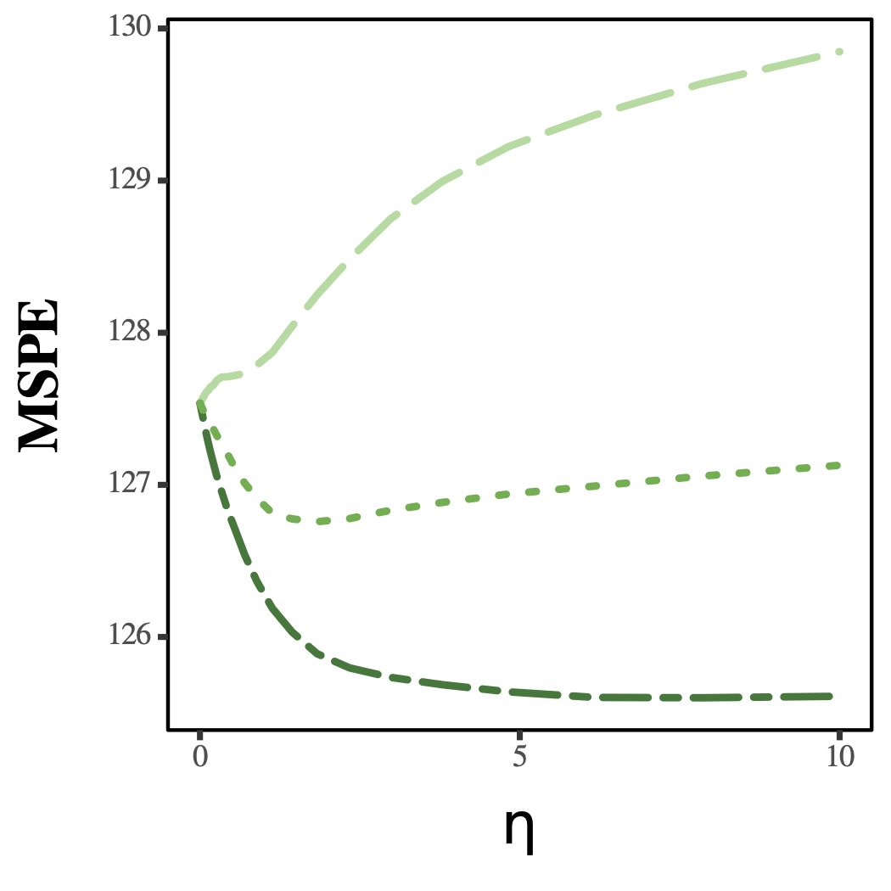{width=50%}


## `BRIERi.multi` with individual-level target data {#sec-BRIERi.multi}

### Data format and preprocessing

`BRIERi.multi` requires:  

- individual-level predictor design matrix and phenotype data from the target cohort, and 
- one or multiple pre-trained external models. External models must be provided from joint model coefficients (e.g., PRS, penalized regression). If only GWAS summary statistics or marginal predictor–trait inner products are available, users should instead refer to [BRIER.S](#sec-BRIERs) to train a joint model directly from summary-level data. Multiple external models can be provided as a column-stacked matrix.

We begin by loading the package:

```{r, echo = TRUE, eval = FALSE}
library(BRIER2)
```

Below we import the phenotype and predictor matrix from target data and external models. Users should subset the predictors to those that are shared between the target and external models. We note that it is strongly recommended to train the external model using this shared set of predictors to minimize heterogeneity between the target and external data. When the external model is obtained from a published study (e.g., published PRS weights), users may reconstruct the external model by assigning coefficient values of zero to predictors that are present in the target data but absent from the external model, or vice versa.

```{r, echo = TRUE, eval = FALSE}

## target cohorts
X_target = read.table("path/to/file")
y_target = read.table("path/to/file") %>% as.vector()
names(y_target) == rownames(X_target)
length(y_target) == nrow(X_target) # sample name and number of observation should be matched

## External models
beta1 = read.table("path/to/file") %>% as.vector()
beta2 = read.table("path/to/file") %>% as.vector()
beta3 = read.table("path/to/file") %>% as.vector()

## reconstruct beta so it matches colnames(X_target) exactly, filling unoverlapped (missing) coefficients with 0
beta_ext1 = setNames(numeric(ncol(X_target)), colnames(X_target))
beta_ext1[intersect(names(beta1), colnames(X_target))] = Ebeta[intersect(names(beta1), colnames(X_target))]
beta_ext2 = setNames(numeric(ncol(X_target)), colnames(X_target))
beta_ext2[intersect(names(beta2), colnames(X_target))] = Ebeta[intersect(names(beta2), colnames(X_target))]
beta_ext3 = setNames(numeric(ncol(X_target)), colnames(X_target))
beta_ext3[intersect(names(beta3), colnames(X_target))] = Ebeta[intersect(names(beta3), colnames(X_target))]
beta_ext = cbind(beta_ext1, beta_ext2, beta_ext3)
```


### Data preprocessing with polygenic risk modeling

Users may also use the function PreprocessI to preprocess target and external data when multiple external models are available in polygenic risk score (PRS) modeling. User should supply target data information through argument `X.target`, `y.target`, `covar.target`, and multiple external data through `ss.ext`, `type.ext`, `N.ext`, `LD.ext`

```{r, echo = TRUE, eval = FALSE}
dat = PreprocessI(
  X.target, y.target, covar.target, standardize.target = T,
  ss.ext, type.ext, N.ext, LD.ext
  )
```

#### Input format of target data

The input format of the target data for `PreprocessI` is identical to that described in [Section 7.2](#sec-PreprocessI). Here, we provide sample scripts to illustrate the required inputs.

```{r, echo = TRUE, eval = FALSE}
X = BEDMatrix("path.bed")
X = as.matrix(X)
y = read.table(XXX)
covar = read.table(XXX)
```

#### Input format of multiple external summary statistics

When multiple external summary statistics are available, users should supply lists to the arguments `ss.ext`, `type.ext`, and `N.ext`, with each list element corresponding to one external data source. The detailed input requirements for `ss.ext` under different `type.ext` are described in [Section 7.2](#sec-PreprocessI).

We further note that if all external summary statistics are derived from the same population, a single LD reference panel may be provided through the `LD.ext` argument. Otherwise, when external sources originate from different populations, `LD.ext` should also be supplied as a list, with each element corresponding to the appropriate LD reference panel for that external dataset.

```{r, echo = TRUE, eval = FALSE}
N_ext1 = 100
type_ext1 = "GWAS"
ss_ext1 = read.table("Target.GWAS.txt", header = TRUE)
LD_ext1 = readRDS(XXX)

N_ext2 = 100
type_ext2 = "corr"
ss_ext2 = read.table("Target.Corr.txt", header = TRUE)
LD_ext2 = readRDS(XXX)

N_ext3 = NULL
type_ext3 = "coef"
ss_ext3 = read.table("Target.Corr.txt", header = TRUE)
LD_ext3 = NULL

N_ext = list(N_ext1, N_ext2, N_ext3)
type_ext = list(type_ext1, type_ext2, type_ext3)
ss_ext = list(ss_ext1, ss_ext2, ss_ext3)
LD_ext = list(LD_ext1, LD_ext2, LD_ext3)

```

### Run `PreprocessI`

With the target and external datasets prepared as described above, we now run `PreprocessI` to perform the required data preprocessing. The function output a list, containing `X` for processed target design matrix, `y` for processed target phenotype, `beta.ext` for a matrix of processed external trained models.

```{r, echo = TRUE, eval = FALSE}
dat = PreprocessI(
  X.target = X_target, y.target = y_target, covar.target = covar_target, standardize.target = T,
  ss.ext = ss_ext, type.ext = type_ext, N.ext = N_ext, LD.ext = LD_ext
  )
```

### Fitting `BRIERi.multi`

Once preprocessing is complete, a `BRIERi.multi` model can be fitted directly. Below we illustrate the Gaussian/LASSO case using the ensemble based strategy:

```{r, echo = TRUE, eval = FALSE}
fit = BRIERi.multi(
    X = dat$X, 
    y = dat$y, 
    beta.ext = dat$beta.ext,
    aggregate = "ensemble",
    eta = exp(seq(0, log(10), length = 20))    
    family = "gaussian",
    penalty = "LASSO"
)
```

### Hyperparameter tuning

Users may use the function `BRIERi.selection` to perform hyperparameter tuning for a fitted `BRIERi.multi` object, using either an independent validation dataset or information-based criteria. Additional details are provided in [Section 7.4](#sec-BRIERi.selection).


## `BRIERs.multi` with summary-level target data {#sec-BRIERs.multi}

### Data preprocessing with polygenic risk modeling

Users may also use the function `PreprocessS` to preprocess target and external summary statistics when multiple external models are available in polygenic risk score (PRS) modeling. User should supply target data information through argument `ss.target`, `type.target`, `N.target`, `LD.target`, and multiple external data through `ss.ext`, `type.ext`, `N.ext`, `LD.ext`

```{r, echo = TRUE, eval = FALSE}
dat = PreprocessS(
  ss.target, type.target, N.target, LD.target, 
  ss.ext, type.ext, N.ext, LD.ext
  )
```

#### Input format of target summary statistics

The input format of the target summary statistics for `PreprocessS` is identical to that described in [Section 8.1](#sec-PreprocessS). Here, we provide sample scripts to illustrate the required inputs.

```{r, echo = TRUE, eval = FALSE}
N_target = 100
type_target = "GWAS"
ss_target = read.table("Target.GWAS.txt", header = TRUE)
head(ss_target)
LD_target = readRDS(XXX)
```

#### Input format of multiple external summary statistics

When multiple external summary statistics are available, users should supply lists to the arguments `ss.ext`, `type.ext`, and `N.ext`, with each list element corresponding to one external data source. The detailed input requirements for `ss.ext` under different `type.ext` are described in [Section 8.1](#sec-PreprocessS).

We further note that if all external summary statistics are derived from the same population, a single LD reference panel may be provided through the `LD.ext` argument. Otherwise, when external sources originate from different populations, `LD.ext` should also be supplied as a list, with each element corresponding to the appropriate LD reference panel for that external dataset.

```{r, echo = TRUE, eval = FALSE}
N_ext1 = 100
type_ext1 = "GWAS"
ss_ext1 = read.table("Target.GWAS.txt", header = TRUE)
LD_ext1 = readRDS(XXX)

N_ext2 = 100
type_ext2 = "corr"
ss_ext2 = read.table("Target.Corr.txt", header = TRUE)
LD_ext2 = readRDS(XXX)

N_ext3 = NULL
type_ext3 = "coef"
ss_ext3 = read.table("Target.Corr.txt", header = TRUE)
LD_ext3 = NULL

N_ext = list(N_ext1, N_ext2, N_ext3)
type_ext = list(type_ext1, type_ext2, type_ext3)
ss_ext = list(ss_ext1, ss_ext2, ss_ext3)
LD_ext = list(LD_ext1, LD_ext2, LD_ext3)

```

### Run `PreprocessS`

With the target and external datasets prepared as described above, we now run `PreprocessI` to perform the required data preprocessing. The function output a list, containing `X` for processed target design matrix, `y` for processed target phenotype, `beta.ext` for a matrix of processed external trained models.

```{r, echo = TRUE, eval = FALSE}
dat = PreprocessS(
  ss.target = ss_target, type.target = type_target, N.target = N_target, LD.target = LD_target, 
  ss.ext = ss_ext, type.ext = type_ext, N.ext = N_ext, LD.ext = LD_ext
)
```

### Fitting `BRIERs.multi`

Once preprocessing is complete, a `BRIERs.multi` model can be fitted directly. Below we illustrate the Gaussian/LASSO case using the ensemble based strategy:

```{r, echo = TRUE, eval = FALSE}
fit = BRIERs.multi(
  GWAS_sum = dat$GWAS_sum, 
  XtX = dat$XtX, 
  beta.ext = dat$beta.prior,
  aggregate = "ensemble",
  eta = exp(seq(0, log(10), length = 20)
  )
```

### Hyperparameter tuning

Users may use the function `BRIERs.selection` to perform hyperparameter tuning for a fitted `BRIERs.multi` object, using either an independent validation dataset or information-based criteria. Additional details are provided in [Section 8.4](#sec-BRIERs.selection).


# Downstream Analysis {#sec-downstream}

In this section, we introduce a suite of downstream analysis tools designed to facilitate performance evaluation, model diagnostics, and biological interpretation. These functions operate on a parameter-tuned `BRIER.selection` object generated from any of the three selection procedures (`BRIERfull.selection`, `BRIERi.selection` or `BRIERs.selection`). It outputs a list containing a ggplot2 object, and the original data for plotting.

## Evaluation of `BRIER2` model {#sec-eval}

We introduce several functions for evaluating the predictive performance of fitted models. For complex outcome from different distribution family, we provide comprehensive evaluation metrics to evaluate `BRIER2` performance, for example, predictive deviance, AUC (binary outcomes), and C-index (survival outcomes). Additional details are provided in the [Appendix](LINK).  

### `plot.eta`  

Except guiding the selection of integration weight $\eta$ in parameter tuning, the `plot.eta` function visualizes predictive performance under user-specified evaluation metrics as a function of the integration weight $\eta$, if a testing set is provided. This plot is particularly useful for assessing heterogeneity between the target (target) data and external sources.

Specifically, `plot.eta` display the predictive performance evaluated on an independent testing set as a function of the integration weight parameter $\eta$, shown as the solid green curve. The light blue dotted line represents the predictive performance of the external model alone, and the black triangle marks the best $\eta$ selected during hyper-parameter tuning. 

In genetic applications such as polygenic risk score (PRS) evaluation, outcome measures often require adjustment for environmental or clinical confounders. In these settings, users should provide a `data.frame` containing the testing-set phenotype, along with the column names corresponding to the trait of interest and relevant confounders. The `standardize.y` option controls whether the phenotype is standardized after confounder adjustment. To further mitigate randomness in performance evaluation, bootstrap resampling is supported and can be used to obtain more stable estimates of predictive accuracy.

The $\eta$-curve highlights the implications of integrating varying degrees of external information into the construction of the integration model on the target population. As a result, it effectively portrays the levels of heterogeneity between datasets and provides guidance on the optimal degree of prior information incorporation. 

**Integrating low heterogeneous external information**

The example below illustrates the integration curves obtained when `BRIER2` incorporates external information with low heterogeneity relative to the target data. Model performance is evaluated using two metrics: Pearson’s $R^2$ (left panel) and mean squared prediction error (MSPE; right panel). As the integration weight $\eta$ increases and more external information is transferred to the target model, predictive performance improves, as indicated by an increase in Pearson’s $R^2$ and a decrease in MSPE. Performance reaches an optimum at an intermediate value of $\eta$ and may decline slightly thereafter. This pattern indicates that integrating external information improves predictive accuracy and suggests that the relative heterogeneity between the target and external data is low.

```{r, echo = TRUE, eval = FALSE}
p <- plot.eta(
  out, X = X_testing, y = y_testing, eval = "gaussian.pearsonrsq", pheno.name = "trait", adjust.covar = c("age", "sex"), 
  standardize.y = T, bootstrap = T, bootstrap.size = 0.8*nrow(X_testing), bootstrap.n = 100
  )
p
p <- plot.eta(
  out, X = X_testing, y = y_testing, eval = "gaussian.mspe", pheno.name = "trait", adjust.covar = c("age", "sex"), 
  standardize.y = T, bootstrap = T, bootstrap.size = 0.8*nrow(X_testing), bootstrap.n = 100
  )
```

<div style="display: flex; justify-content: space-between;">
  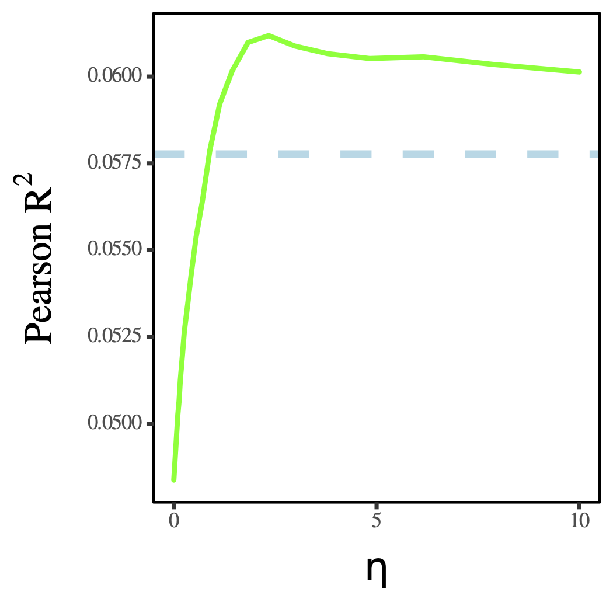
  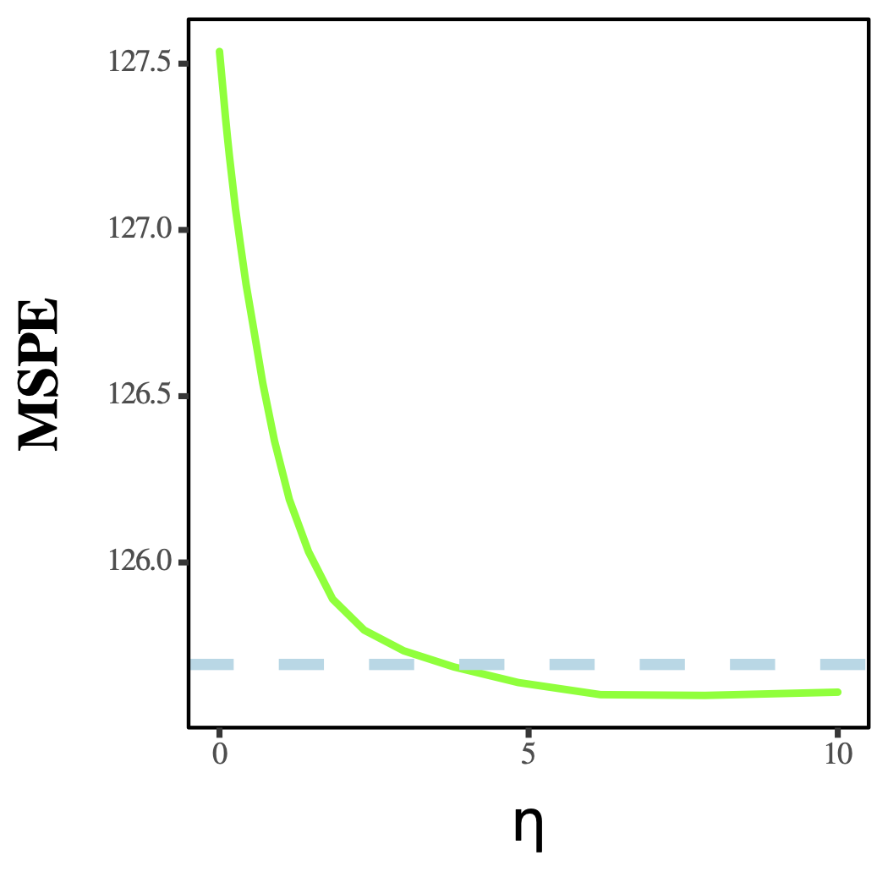
</div>

**Integrating high heterogeneous external information**

The example below illustrates the integration curves obtained when `BRIER2` incorporates external information with high heterogeneity relative to the target data. Model performance is evaluated using two metrics: Pearson’s $R^2$ (left panel) and mean squared prediction error (MSPE; right panel). As the integration weight $\eta$ increases and more external information is transferred to the target model, predictive performance deteriorates, as indicated by an decrease in Pearson’s $R^2$ and a increase in MSPE. This pattern indicates that integrating external information does not improve predictive accuracy and suggests that the relative heterogeneity between the target and external data is high.

```{r, echo = TRUE, eval = FALSE}
p <- plot.eta(
  out, X = X_testing, y = y_testing, eval = "gaussian.pearsonrsq", pheno.name = "trait", adjust.covar = c("age", "sex"), 
  standardize.y = T, bootstrap = T, bootstrap.size = 0.8*nrow(X_testing), bootstrap.n = 100
  )
p
p <- plot.eta(
  out, X = X_testing, y = y_testing, eval = "gaussian.mspe", pheno.name = "trait", adjust.covar = c("age", "sex"), 
  standardize.y = T, bootstrap = T, bootstrap.size = 0.8*nrow(X_testing), bootstrap.n = 100
  )
```

<div style="display: flex; justify-content: space-between;">
  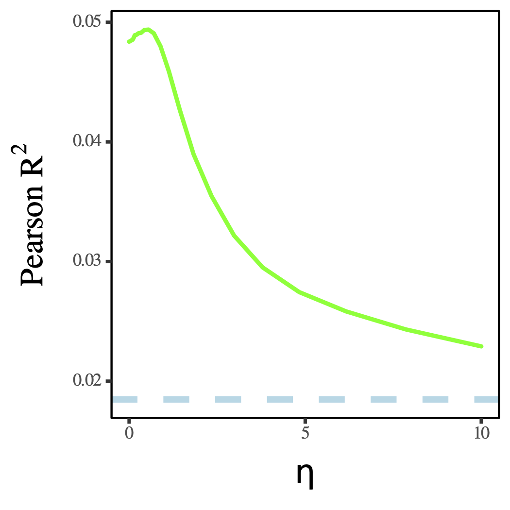
  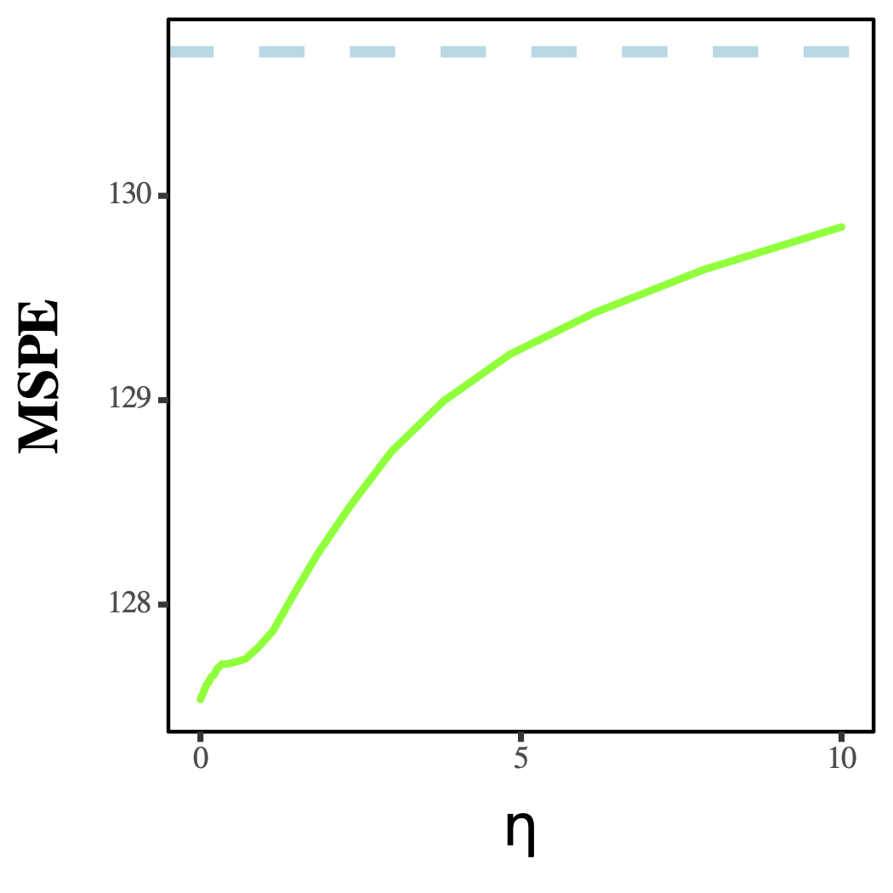
</div>


**Multiple fitted BRIER2 objects**

A list of fitted BRIER.selection objects can also be supplied to this function. This functionality is particularly useful when multiple external models are available, as it allows users to assess the degree of heterogeneity between each external model and the same target (target) dataset, and to determine which external sources are likely to be beneficial for integration.

In the example below, three BRIER models are fitted by integrating different external models with the same target data. The model corresponding to the dashed light-green curve shows no improvement in predictive Pearson's $R^2$ (left) or mspe (right) across values of $\eta$, indicating substantial heterogeneity with the target data. Consequently, users may reasonably exclude this external model when jointly integrating multiple sources using `BRIER.multi`.

```{r, echo = TRUE, eval = FALSE}
p <- plot.eta(
  out.list, X = X_testing, y = y_testing, eval = "gaussian.mspe", pheno.name = "trait", adjust.covar = c("age", "sex"), 
  standardize.y = T, bootstrap = T, bootstrap.size = 0.8*nrow(X_testing), bootstrap.n = 100
  )
p
p <- plot.eta(
  out.list, X = X_testing, y = y_testing, eval = "gaussian.pearsonrsq", pheno.name = "trait", adjust.covar = c("age", "sex"), 
  standardize.y = T, bootstrap = T, bootstrap.size = 0.8*nrow(X_testing), bootstrap.n = 100
  )
p
```

<div style="display: flex; justify-content: space-between;">
  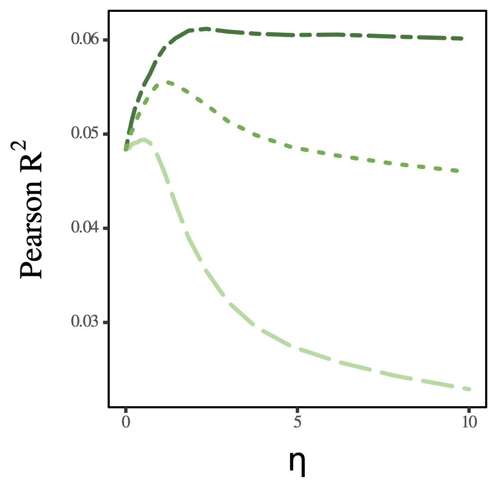
  
</div>


### `plot.box`  

The `plot.box` function provides a complementary perspective for evaluating `BRIER` models. It visualizes the distribution of predictive performance across bootstrap resamples using boxplots, thereby capturing variability introduced by sampling randomness. Below, we illustrate `plot.box` under settings where the external information exhibits low and high heterogeneity relative to the target (target) data.

**Integrating low heterogeneous external information**

In the example below, the external model achieves stronger predictive performance than the target-only model (higher Pearson $R^2$ and lower MSPE), suggesting relatively low heterogeneity between the target and external data. By appropriately integrating external information, the `BRIER2` model further improves predictive accuracy, demonstrating the benefit of information borrowing when external sources are well aligned with the target population.

```{r, echo = TRUE, eval = FALSE}
p <- plot.box(
  out, X = X_testing, y = y_testing, eval = "gaussian.pearsonrsq", pheno.name = "trait", adjust.covar = c("age", "sex"), 
  standardize.y = T, bootstrap.size = 0.8*nrow(X_testing), bootstrap.n = 100
  )
p
p <- plot.box(
  out, X = X_testing, y = y_testing, eval = "gaussian.mspe", pheno.name = "trait", adjust.covar = c("age", "sex"), 
  standardize.y = T, bootstrap.size = 0.8*nrow(X_testing), bootstrap.n = 100
  )
p
```

<div style="display: flex; justify-content: space-between;">
  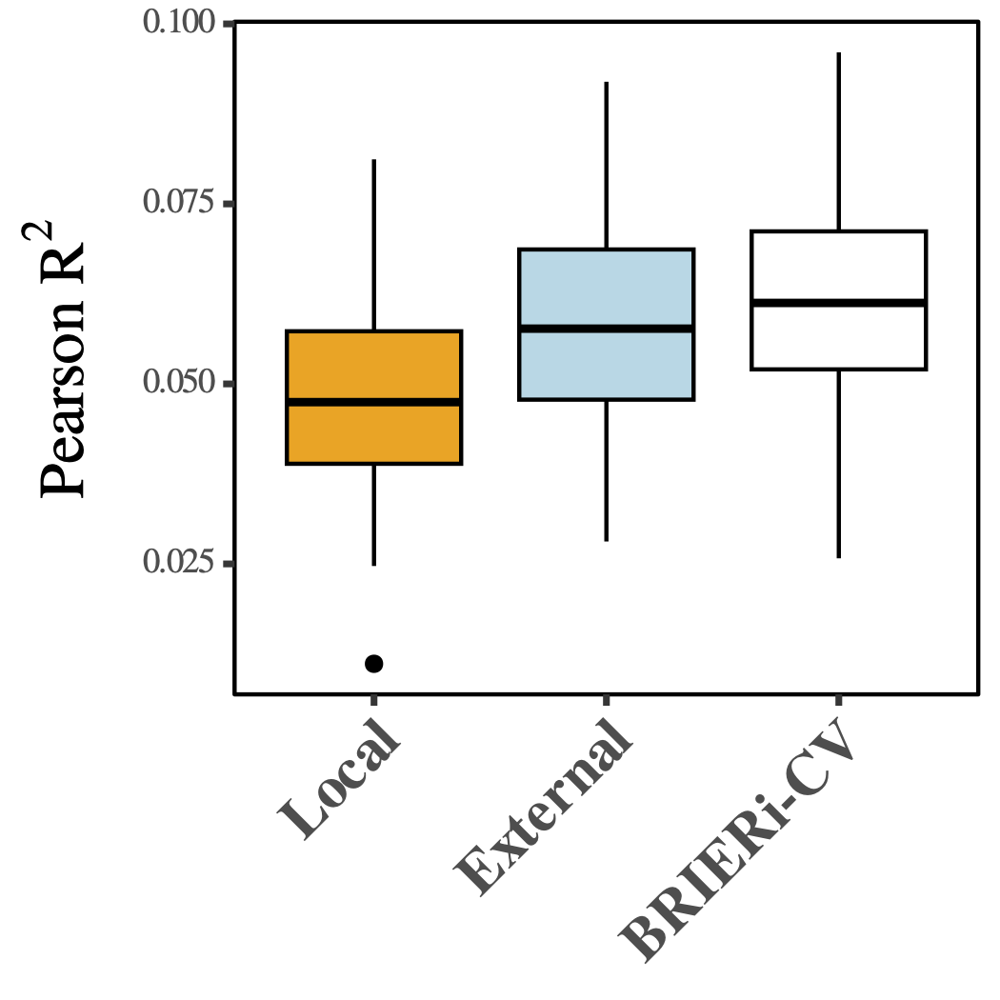
  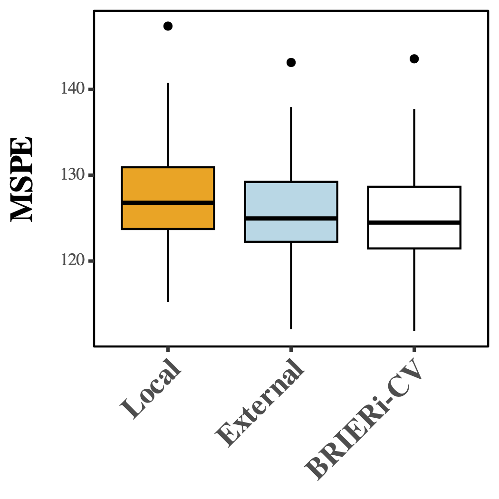
</div>

**Integrating high heterogeneous external information**

In contrast, the example below illustrates a setting where the external model performs poorly relative to the target-only model (lower Pearson $R^2$ and higher MSPE), indicating substantial heterogeneity between the target and external data. As the integration weight increases, incorporating external information does not improve (and may even degrade) predictive performance. This pattern suggests that the external source is not well matched to the target population and may be excluded from joint integration.

```{r, echo = TRUE, eval = FALSE}
p <- plot.box(
  out, X = X_testing, y = y_testing, eval = "gaussian.pearsonrsq", pheno.name = "trait", adjust.covar = c("age", "sex"), 
  standardize.y = T, bootstrap.size = 0.8*nrow(X_testing), bootstrap.n = 100
  )
p
p <- plot.box(
  out, X = X_testing, y = y_testing, eval = "gaussian.mspe", pheno.name = "trait", adjust.covar = c("age", "sex"), 
  standardize.y = T, bootstrap.size = 0.8*nrow(X_testing), bootstrap.n = 100
  )
p
```

<div style="display: flex; justify-content: space-between;">
  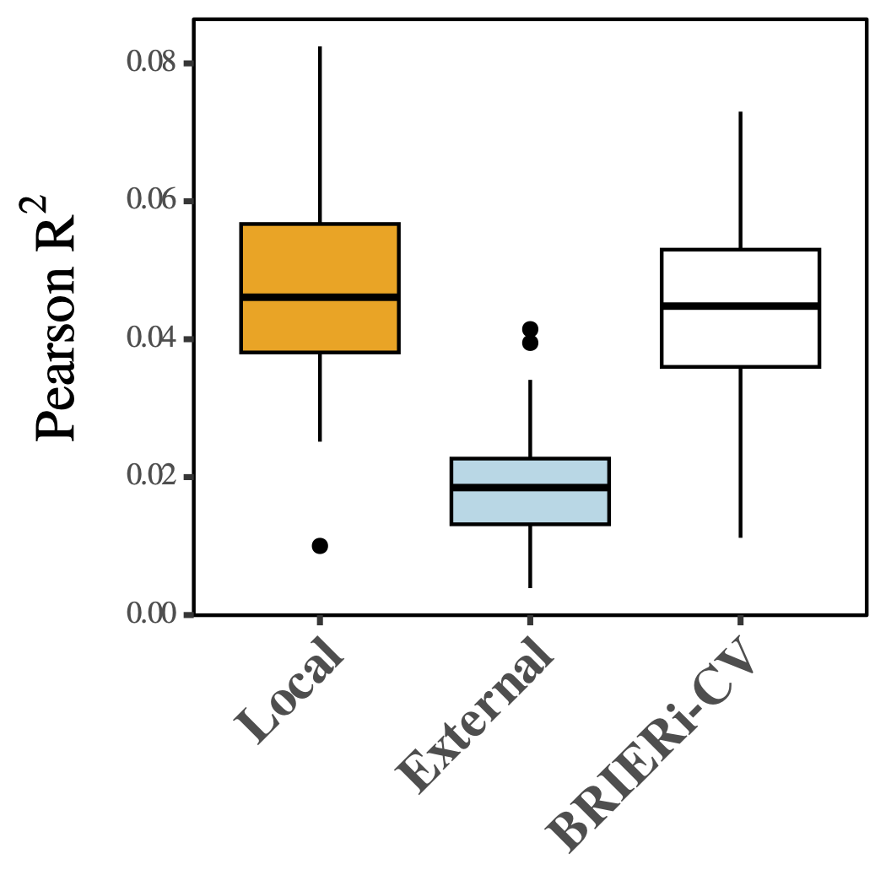
  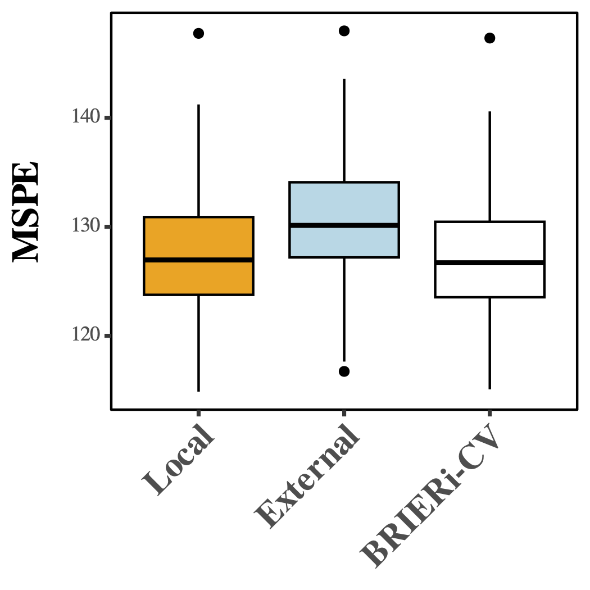
</div>


## Variable importance {#sec-importance}

The `plot.importance` function provides a stability-based assessment of variable importance by repeatedly re-validation the fitted model on bootstrap resamples of the validation data. For each replication, the procedure records which predictors enter the model, and it summarizes their selection frequencies across all resamples. The resulting plot displays the predictors ranked by how consistently they are selected, offering an interpretable measure of feature importance that complements effect-size estimates. High-frequency markers indicate stable, reproducible signals that contribute to prediction performance, whereas low-frequency markers may reflect noise or dataset-specific fluctuations. This diagnostic is particularly valuable in high-dimensional genomic settings, where model sparsity and sampling variability can obscure truly informative predictors.

```{r, echo = TRUE, eval = FALSE}
p <- plot.importance(out, X = X_validation, y = y_validation, n.top = 10, replications = 100, seed = 1)
p
```

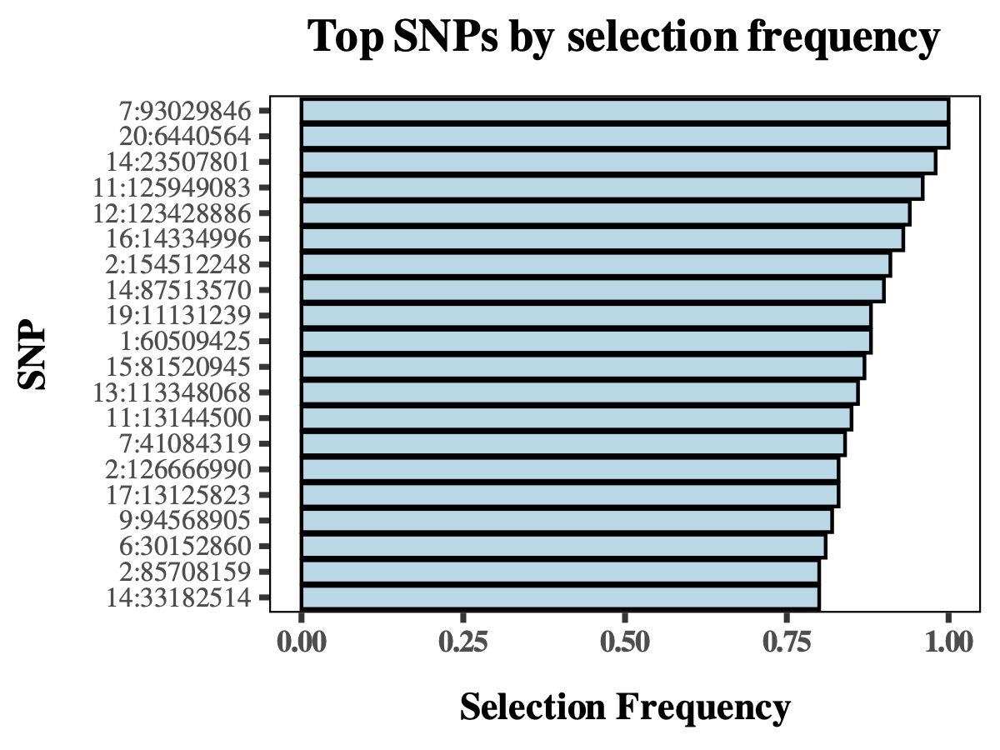{width=50%}

By specifying `n.top = NA`, the `plot.importance` function will output the selection frequency distribution histogram for all prediction.

```{r, echo = TRUE, eval = FALSE}
p <- plot.importance(out, X = X_validation, y = y_validation, n.top = NA, replications = 100, seed = 1)
p
```

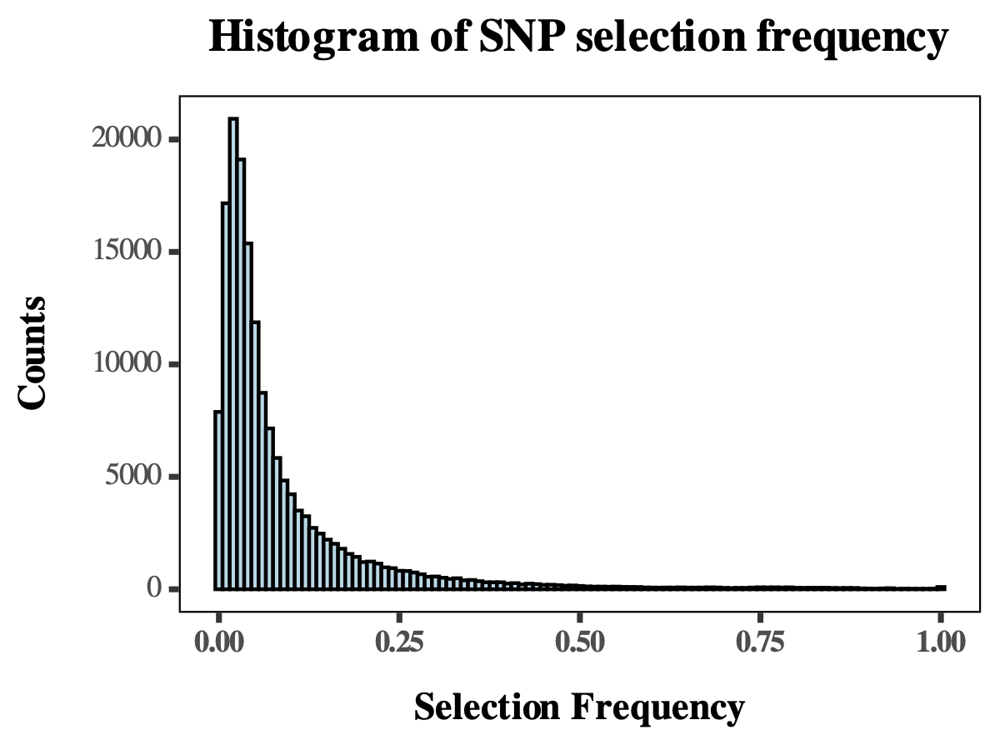{width=50%}


## PRS stratification {#sec-prs_strat}

The `plot.strat` presents the distribution of continuous traits in test data stratified by a percentile cut-off (Pct) of the target, external only model and `BRIER2` integration. These plots further visualize the discrimination power of each model. In the plots, we compare the median distance between the upper and lower percentile stratification of the observed outcome distribution, and show the distance in the title of the plots. [HOW TO QUANTIFY THIS]

```{r, echo = TRUE, eval = FALSE}
p <- plot.strat(out, X = X_testing, y = y_testing, lower = 0.4, upper = 0.4)
p
```

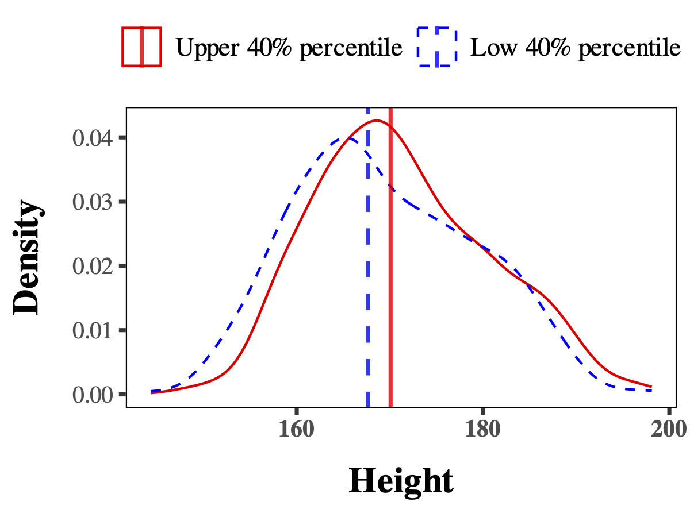{width=50%}


## Performing TWAS on trait of interest {#sec-TWAS}


